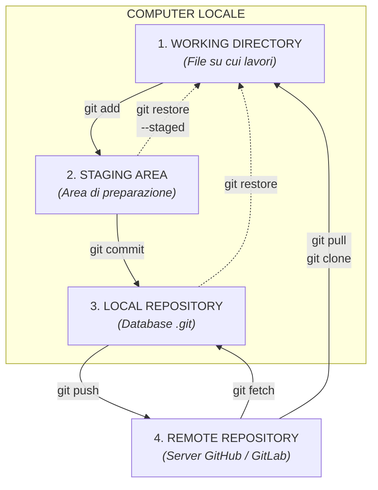
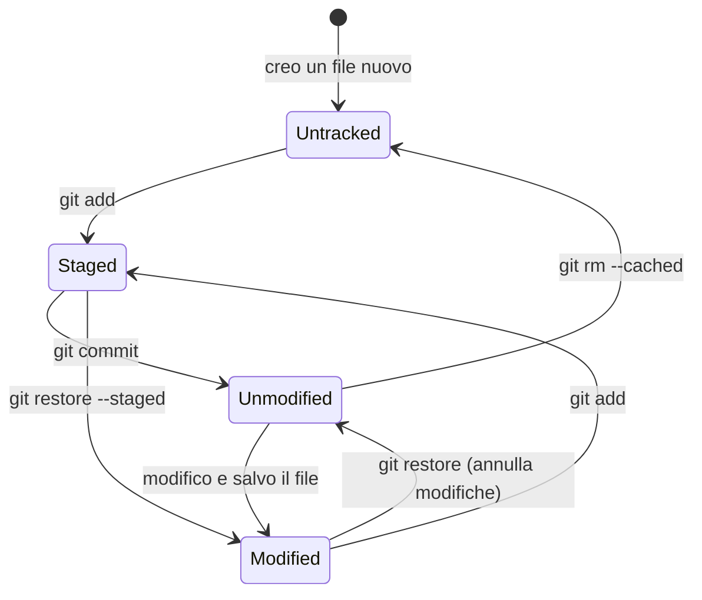
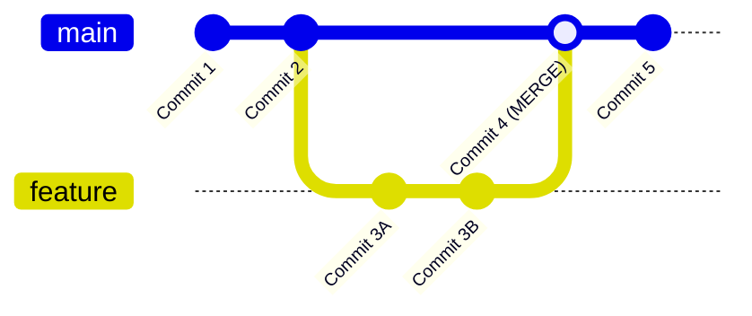
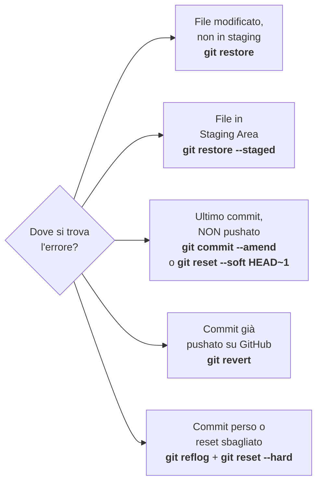

# Guida Git – Livello Base

[[Git 0 - Indice|← Indice]] · [[Git 2 - Intermedio|Livello intermedio →]]

Tutto ciò che serve per usare Git ogni giorno da soli: concetti, installazione, salvataggio delle modifiche, storico, branch, GitHub e correzione degli errori più comuni.

Al termine di questo livello sai: creare o clonare un repository, fare commit e push, consultare lo storico, lavorare con i branch, risolvere un conflitto e annullare un errore.

---

## 1. Glossario Concettuale: Che cos'è Git e come funziona?

Prima di usare i comandi, è importante comprendere la terminologia fondamentale di Git e le sue analogie nel mondo reale.

### Perché usare Git? (Il problema che risolve)
Senza un sistema di versionamento si finisce con cartelle piene di file come:

```text
calcolo_deformata.py
calcolo_deformata_v2.py
calcolo_deformata_v2_corretto.py
calcolo_deformata_v3_FINALE.py
calcolo_deformata_v3_FINALE_davvero.py
```

Con Git esiste **un solo file** `calcolo_deformata.py`, e tutte le versioni precedenti sono conservate nello storico, ciascuna con data, autore e una descrizione di cosa è cambiato. Puoi tornare a qualsiasi versione in qualsiasi momento.

### Repository (Repo)
* **Cos'è:** È il contenitore principale del tuo progetto. Non si limita a conservare la versione attuale dei file, ma contiene l'intero **storico e la cronologia delle modifiche** effettuate fin dal primo giorno.
* **Tipi:**
  * **Repository Locale:** La cartella del progetto sul tuo computer (gestita dal database nascosto `.git`).
  * **Repository Remota:** La copia salvata sul cloud (su server come GitHub, GitLab o Bitbucket) che permette di fare backup e lavorare in team.

### Git vs GitHub
* **Git** è il programma installato sul tuo computer che traccia le versioni. Funziona anche **senza internet** e senza GitHub.
* **GitHub** è un sito web che ospita repository remote. È solo uno dei possibili "server" a cui Git può inviare il codice.

### Le tre zone locali
* **Working Directory (Cartella di lavoro):** i file che vedi e modifichi normalmente con l'editor.
* **Staging Area (Area di preparazione):** una "sala d'attesa" dove metti le modifiche che vuoi includere nel prossimo commit. Ti permette di scegliere **cosa** salvare, anche solo alcuni file tra quelli modificati.
* **Local Repository:** il database `.git` dove i commit vengono archiviati in modo permanente.

> [!example] Analogia
> Pensa a una spedizione: la **Working Directory** è la scrivania con tutti i documenti, la **Staging Area** è lo scatolone in cui metti solo i documenti da spedire, il **commit** è chiudere lo scatolone ed etichettarlo, il **push** è consegnarlo al corriere (GitHub).

### Commit
* **Cos'è:** Una "fotografia" (o istantanea) dello stato del tuo progetto in un preciso momento.
* **Come funziona:** Ogni volta che fai un commit, Git crea un punto di ripristino sicuro caratterizzato da un codice alfanumerico univoco (Hash ID, es. `a1b2c3d`), un autore, la data e un messaggio esplicativo scritto da te.
* **Nota:** Il commit avviene **solo in locale**. Su GitHub arriva solo dopo un `git push`.

### Hash
* **Cos'è:** L'identificativo univoco di ogni commit (40 caratteri, es. `a1b2c3d4e5f6...`). Nei comandi basta scrivere i **primi 7 caratteri** (es. `a1b2c3d`), che trovi con `git log --oneline`.

### File Tracciati e Non Tracciati
* **Untracked (non tracciato):** file nuovo che Git vede ma non sta ancora seguendo. Finché non fai `git add`, non entra nello storico.
* **Tracked (tracciato):** file che è già stato incluso in almeno un commit. Git ne segue ogni modifica.

### Branch (Ramo)
* **Cos'è:** Una linea temporale di sviluppo parallela e indipendente.
* **Perché si usa:** Permette di sviluppare nuove funzionalità o correggere errori (*bugfix*) senza intaccare la versione principale e stabile del codice (`main` o `master`). Quando il lavoro sul ramo è completato e testato, viene unito al ramo principale.
* **`main` vs `master`:** sono solo due nomi diversi per il ramo principale. GitHub oggi usa `main`; le vecchie installazioni di Git usano `master`.

### Merge e Conflitti
* **Merge:** L'operazione di fusione con cui Git prende i commit di un branch secondario e li integra all'interno di un altro branch.
* **Conflitto:** Si verifica quando due branch hanno modificato la **stessa riga dello stesso file** in modi diversi. Git non sa quale versione scegliere automaticamente e chiede all'utente di selezionare la versione corretta.

### HEAD
* **Cos'è:** Un puntatore interno (un "segnalibro") che indica a Git **su quale branch o commit ti trovi attualmente**.
* **Notazione relativa:** `HEAD~1` indica il commit precedente a quello attuale, `HEAD~2` quello ancora prima, e così via. Utile per non dover copiare gli hash.

### Remote e `origin`
* **Remote:** un collegamento a una repository remota.
* **`origin`:** il nome convenzionale (un "soprannome") dato alla repository remota principale. Invece di scrivere ogni volta l'URL completo di GitHub, scrivi `origin`.

### Clone, Push, Pull, Fetch
* **Clone:** scaricare per la prima volta un'intera repository remota sul tuo computer.
* **Push:** inviare i tuoi commit locali al remoto.
* **Fetch:** scaricare le novità dal remoto **senza** toccare i tuoi file.
* **Pull:** scaricare le novità **e** unirle subito ai tuoi file (`fetch` + `merge`).

### Tag
* **Cos'è:** Un'etichetta fissa applicata a un commit specifico, tipicamente per marcare una versione rilasciata o validata (es. `v1.0`). A differenza di un branch, un tag non si sposta mai.

---

## 2. Anatomia Interna della Cartella `.git`

Quando esegui `git init`, Git crea la cartella nascosta `.git`. È il "cervello" della repository dove risiedono il database interno, lo storico e i puntatori.

> [!warning] Attenzione
> - **Non modificare manualmente** i file dentro `.git`: usa sempre i comandi Git.
> - **Se cancelli la cartella `.git` perdi tutto lo storico** del progetto (i file attuali restano, ma Git "dimentica" ogni versione precedente). Se esiste una copia su GitHub, lo storico è recuperabile con `git clone`.

### Struttura delle Cartelle e dei File Principali

```
.git/
├── HEAD
├── config
├── description
├── index (creato dopo il primo 'git add')
├── hooks/
├── info/
│   └── exclude
├── logs/
├── objects/
└── refs/
    ├── heads/
    ├── remotes/
    └── tags/
```

### Componenti Principali

- **`HEAD`** – File di testo che contiene il riferimento al ramo corrente su cui stai lavorando (es. `ref: refs/heads/main`). Puoi leggerlo da terminale con `cat .git/HEAD`.
    
- **`config`** – File di configurazione specifico per la repository locale (es. l'URL di `origin`). Sovrascrive le impostazioni globali dell'utente per questo progetto.

- **`description`** – Usato solo dal vecchio servizio web GitWeb. Puoi ignorarlo.
    
- **`index`** _(o Staging Area)_ – File binario creato non appena usi `git add`. Mantiene l'elenco dei file e delle modifiche preparati per il successivo `git commit`.

- **`logs/`** – Registro di tutti gli spostamenti di HEAD e dei branch. È la base del comando `git reflog`, il "salvagente" per recuperare commit apparentemente persi (vedi sezione 13).
    
- **`objects/`** – Il database vero e proprio di Git. Memorizza i file di codice (_Blobs_), le cartelle (_Trees_) e i salvataggi (_Commits_) compressi e identificati da codici hash alfanumerici (SHA-1 di 40 caratteri).
    
- **`refs/`** – Contiene i riferimenti (puntatori) agli hash dei commit:
    
    - `refs/heads/`: contiene un file per ogni branch locale con l'hash dell'ultimo commit del ramo.

    - `refs/remotes/`: contiene l'ultima posizione conosciuta dei branch remoti (es. `origin/main`), aggiornata da `git fetch` e `git pull`.
        
    - `refs/tags/`: contiene i riferimenti alle versioni rilasciate (_tags_).
        
- **`hooks/`** – Cartella contenente script di esempio che è possibile attivare per automatizzare controlli prima o dopo comandi Git (es. test automatici prima di un commit).
    
- **`info/exclude`** – Funziona come un file `.gitignore` locale, ma le sue regole valgono solo per il tuo PC e non vengono condivise con la repository remota.

---

## 3. Architettura Visuale di Git (Diagrammi Mermaid per Obsidian)

### Flusso delle Zone di Lavoro Locale e Remoto

![[Pasted image 20261006102400.png]]



*Le frecce continue portano le modifiche "avanti"; le frecce tratteggiate le annullano o le riportano indietro. `git pull` equivale a `git fetch` + `git merge`; `git clone` si usa solo la prima volta, per scaricare il repository.*

---

### Ciclo di Vita di un File

Ogni file del progetto si trova sempre in uno di questi stati. `git status` ti dice in quale.



| Stato | Colore in `git status` | Significato |
| :--- | :--- | :--- |
| **Untracked** | Rosso (sezione *Untracked files*) | File nuovo, Git non lo segue ancora |
| **Modified** | Rosso (sezione *Changes not staged*) | File tracciato, modificato ma non ancora preparato |
| **Staged** | Verde (sezione *Changes to be committed*) | Pronto per il prossimo commit |
| **Unmodified** | Non compare | Identico all'ultimo commit |

---

### Struttura e Timeline dei Branch (GitGraph)



---

## 4. Navigazione e Comandi Base di Bash (Terminale)

Su Windows questi comandi si usano in **Git Bash** (installato insieme a Git). Il Prompt dei comandi (`cmd`) e PowerShell usano comandi in parte diversi.

### Spostarsi tra le cartelle
* `pwd` – (*Print Working Directory*) Mostra la cartella corrente in cui ti trovi.
* `ls` – Elenca i file e le cartelle visibili.
* `ls -a` – Elenca tutti i file e le cartelle, inclusi i **file nascosti** (come la cartella `.git`).
* `ls -la` – Come sopra, ma con dettagli (dimensione, data di modifica).
* `cd <percorso>` – (*Change Directory*) Cambia cartella.
* `cd ..` – Sale di un livello.
* `cd ~` – Torna alla cartella utente (es. `C:/Users/TuoNome`).
* `cd -` – Torna alla cartella in cui eri prima.

> [!note] Percorsi Windows in Git Bash
> Git Bash usa le barre `/` e scrive i dischi in minuscolo:
> `C:\Users\Mario\Progetti` diventa `/c/Users/Mario/Progetti`
> Se il percorso contiene spazi, mettilo tra virgolette: `cd "/c/Users/Mario/I miei progetti"`

### Gestire file e cartelle
* `mkdir <nome_cartella>` – Crea una nuova cartella.
* `touch <nome_file>` – Crea un nuovo file vuoto (es. `touch main.py`).
* `echo "testo" > file.txt` – Scrive del testo nel file, **sovrascrivendo** il contenuto precedente.
* `echo "testo" >> file.txt` – **Aggiunge** il testo in fondo al file, senza cancellare il resto.
* `cat <nome_file>` – Stampa a schermo il contenuto di un file.
* `cp <origine> <destinazione>` – Copia un file.
* `mv <origine> <destinazione>` – Sposta o rinomina un file.
* `rm <nome_file>` – Elimina un file (**non passa dal cestino!**).
* `rm -r <nome_cartella>` – Elimina una cartella con tutto il suo contenuto (**irreversibile**).
* `explorer .` – *(Windows)* Apre la cartella corrente in Esplora File.
* `code .` – Apre la cartella corrente in VS Code (se installato).
* `clear` – Pulisce la schermata del terminale.

### Scorciatoie utili
* **Tab** – Completa automaticamente nomi di file, cartelle e comandi. Usalo sempre: evita errori di battitura.
* **Freccia su / giù** – Richiama i comandi digitati in precedenza.
* **Ctrl + C** – Interrompe il comando in esecuzione.
* **`q`** – Esce dalle schermate a scorrimento (es. `git log`, `git diff`) quando in fondo vedi `:` o `(END)`.
* **Copia/Incolla in Git Bash** – `Ctrl + Insert` / `Shift + Insert`, oppure tasto destro del mouse.

---

## 5. Installazione, Configurazione e Autenticazione

### Installazione (una tantum)
1. Scarica **Git for Windows** da `git-scm.com` e installalo (le opzioni predefinite vanno bene).
2. Apri **Git Bash** e verifica: `git --version`

### Configurazione Utente (una tantum)
* `git config --global user.name "Il Tuo Nome"` – Imposta il nome autore per tutti i commit.
* `git config --global user.email "tua_email@example.com"` – Imposta l'email associata ai commit (usa la stessa del tuo account GitHub).
* `git config --global init.defaultBranch main` – Fa sì che i nuovi repository usino `main` come ramo principale (come GitHub).
* `git config --global core.autocrlf true` – *(Su Windows)* Converte automaticamente i fine riga CRLF/LF.
* `git config --global core.autocrlf input` – *(Su macOS / Linux)* Gestisce la conversione dei fine riga.
* `git config --global core.editor "code --wait"` – *(Opzionale)* Usa VS Code al posto di Vim quando Git ha bisogno di un editor di testo.
* `git config --list` – Mostra le impostazioni correnti di Git.

> [!info] `--global` o locale?
> - **Con `--global`**: l'impostazione vale per tutti i repository del tuo PC.
> - **Senza `--global`** (eseguito dentro un repository): vale solo per quel progetto e ha la precedenza su quella globale. Utile, ad esempio, per usare un'email aziendale in un progetto e una personale in un altro.

### Autenticazione con GitHub
GitHub **non accetta più la password dell'account** per `push` e `pull` da terminale. Le alternative sono:

1. **Git Credential Manager** *(il più semplice, incluso in Git for Windows)*: al primo `git push` si apre una finestra del browser in cui fai il login a GitHub (anche con "Continua con Google", se hai creato l'account così). Le credenziali vengono poi salvate e non ti verranno più chieste.
2. **Personal Access Token (PAT)**: una "password speciale" generata su GitHub (*Settings → Developer settings → Personal access tokens*) da incollare quando il terminale chiede la password.
3. **Chiave SSH**: più avanzata, utile se lavori su molti PC o server.

### Ottenere aiuto
* `git help <comando>` – Apre il manuale completo di un comando (es. `git help commit`).
* `git <comando> -h` – Mostra un riepilogo rapido delle opzioni direttamente nel terminale.

---

## 6. Avviare un Progetto: i Due Scenari Tipici

### Scenario A — Il repository esiste già su GitHub *(consigliato)*
Caso tipico: hai creato il repository dal sito di GitHub (magari con README e `.gitignore`).

```bash
cd /c/Users/TuoNome/Progetti          # vai nella cartella che conterrà il progetto
git clone https://github.com/UTENTE/NOME-REPO.git
cd NOME-REPO                          # entra nella cartella appena creata
# copia qui dentro i tuoi script, poi:
git status
git add .
git commit -m "Primo caricamento degli script"
git push
```

Con `git clone` il collegamento a `origin` è già configurato: non serve `git remote add`.

### Scenario B — Hai già una cartella locale e vuoi metterla su GitHub
1. Crea su GitHub un repository **vuoto** (senza README, senza `.gitignore`, senza licenza).
2. Nel terminale:

```bash
cd /c/Users/TuoNome/Progetti/mio_progetto
git init
git add .
git commit -m "Primo commit"
git branch -M main                    # assicura che il ramo si chiami main
git remote add origin https://github.com/UTENTE/NOME-REPO.git
git push -u origin main
```

> [!warning] Errore frequente
> Se nello Scenario B il repository GitHub **non** era vuoto (ad esempio contiene un README), il push verrà rifiutato perché le due storie sono diverse. Soluzione:
> `git pull origin main --allow-unrelated-histories`, poi `git push -u origin main`.
> Per evitarlo: se il repository su GitHub ha già dei file, usa lo **Scenario A**.

### Giornata tipo di lavoro

```bash
git pull                              # 1. inizio giornata: scarica eventuali novità
# ... lavori sui file ...
git status                            # 2. controlla cosa hai cambiato
git diff                              # 3. (opzionale) rivedi le modifiche riga per riga
git add .                             # 4. prepara le modifiche
git commit -m "Descrizione chiara"    # 5. salva in locale (anche più volte al giorno)
git push                              # 6. fine giornata: invia tutto a GitHub
```

---

## 7. Flusso di Lavoro Fondamentale (Status, Add, Commit)

I comandi da utilizzare quotidianamente per tracciare e salvare le modifiche:

### Controllare lo stato
* `git status` – **(Fondamentale)** Mostra lo stato dei file: modificati, non tracciati (*untracked* - in rosso), pronti al commit (*staged* - in verde).
* `git status -s` – Versione compatta: una riga per file con un codice (`??` = non tracciato, `M` = modificato, `A` = aggiunto).

### Preparare (Staging)
* `git add <nome_file>` – Aggiunge un file specifico alla **Staging Area**.
* `git add .` – Aggiunge **tutti** i file nuovi, modificati ed eliminati della cartella attuale (e sottocartelle) alla Staging Area.
* `git add *.py` – Aggiunge alla Staging Area tutti i file con estensione `.py`.
* `git add -p` – Modalità interattiva: Git ti mostra ogni blocco di modifiche e ti chiede se includerlo (`y` = sì, `n` = no, `q` = esci). Utile per dividere modifiche diverse in commit separati.

### Salvare (Commit)
* `git commit -m "Messaggio esplicativo"` – Crea un punto di salvataggio (*commit*) dei file presenti in Staging Area.
* `git commit -m "Titolo breve" -m "Descrizione dettagliata..."` – Registra un commit con titolo e paragrafo esplicativo.
* `git commit -am "Messaggio"` – Esegue `add` e `commit` contemporaneamente, **ma solo per i file già tracciati**: i file nuovi vanno comunque aggiunti con `git add`.

> [!note] Se dimentichi `-m`
> Git apre un editor di testo (di default **Vim**) per farti scrivere il messaggio. Per uscire da Vim: scrivi il messaggio, premi `Esc`, digita `:wq` e premi `Invio`. Per annullare senza salvare: `Esc`, poi `:q!` e `Invio`.

### Eliminare, spostare, smettere di tracciare
* `git rm <nome_file>` – Elimina il file dal disco **e** registra l'eliminazione per il prossimo commit.
* `git rm --cached <nome_file>` – Smette di tracciare il file **senza cancellarlo dal disco**. Indispensabile quando aggiungi al `.gitignore` un file già committato.
* `git mv <vecchio_nome> <nuovo_nome>` – Rinomina o sposta un file mantenendo lo storico collegato.

### Come scrivere buoni messaggi di commit
* Titolo breve (idealmente sotto i 50 caratteri), che descriva **cosa** fa il commit.
* Usa un verbo all'inizio, sempre con lo stesso stile (es. "Aggiunge…", "Corregge…", "Rimuove…").
* Un commit = una modifica logica. Meglio tre commit piccoli e chiari che uno enorme.

| ❌ Da evitare | ✅ Meglio |
| :--- | :--- |
| `"modifiche"` | `"Aggiunge calcolo del raggio di ritorno elastico"` |
| `"fix"` | `"Corregge unità di misura del modulo elastico (MPa)"` |
| `"aggiornamento vari file"` | `"Sposta le costanti del materiale in config.py"` |

---

## 8. Ispezione dello Storico e Confronto Codice (Log, Diff)

Comandi per verificare le modifiche apportate e navigare nel tempo:

### Storico
* `git log` – Mostra la cronologia completa dei commit (autore, data, messaggio e codice hash del commit).
* `git log --oneline` – Mostra la cronologia sintetica con un commit per riga.
* `git log -n 5` – Mostra solo gli ultimi 5 commit.
* `git log --stat` – Mostra, per ogni commit, quali file sono cambiati e quante righe.
* `git log -p` – Mostra i commit unitamente alle singole righe di codice modificate.
* `git log -- <nome_file>` – Mostra solo i commit che hanno modificato quel file.
* `git log --graph --oneline --all` – Visualizza un grafico testuale della struttura dei branch e dei merge.
* `git show <hash>` – Mostra il dettaglio completo di un singolo commit (messaggio + modifiche).
* `git blame <nome_file>` – Mostra, riga per riga, chi l'ha modificata per ultimo e in quale commit.

### Confronti
* `git diff` – Confronta le modifiche nella **Working Directory** con la Staging Area (cioè: cosa hai cambiato ma non ancora aggiunto).
* `git diff --staged` (o `git diff --cached`) – Confronta le modifiche in **Staging Area** con l'ultimo commit (cioè: cosa finirà nel prossimo commit).
* `git diff HEAD` – Confronta tutte le modifiche (staged e non) con l'ultimo commit.
* `git diff <hash_commit1> <hash_commit2>` – Confronta due commit specifici tramite il loro codice ID/Hash.
* `git diff main feature` – Confronta lo stato finale di due branch.

> [!tip] Lettura di un diff
> Le righe che iniziano con `+` (verdi) sono state aggiunte, quelle con `-` (rosse) sono state rimosse. Una riga modificata appare come una riga `-` seguita da una riga `+`.

---

## 9. Il File `.gitignore`

Il file `.gitignore` viene posizionato nella cartella principale del progetto e contiene la lista di file e cartelle che **Git non deve mai tracciare** (es. credenziali, file temporanei, risultati pesanti delle simulazioni).

### Sintassi
| Regola | Effetto |
| :--- | :--- |
| `file.txt` | Ignora tutti i file con quel nome, in qualsiasi cartella |
| `*.log` | Ignora tutti i file con estensione `.log` |
| `risultati/` | Ignora l'intera cartella `risultati` |
| `/config.env` | Ignora solo il file nella cartella principale |
| `!importante.log` | **Eccezione:** traccia questo file anche se `*.log` è ignorato |
| `# testo` | Commento |

### Esempio per progetti Python + Abaqus
```text
# ---------- Python ----------
__pycache__/
*.py[cod]
.venv/
venv/
.ipynb_checkpoints/

# ---------- Credenziali e configurazioni locali ----------
.env
config.env
*.key

# ---------- Abaqus: file temporanei e di output ----------
*.odb
*.lck
*.msg
*.dat
*.sta
*.com
*.prt
*.sim
*.res
*.mdl
*.stt
*.abq
*.pac
*.sel
*.023
*.ipm
*.log
*.rpy
*.rpy.*
*.rec
abaqus_acis.log

# ---------- Subroutine Fortran compilate ----------
*.obj
*.o
*.dll
*.so

# ---------- Cartelle di risultati (personalizzare) ----------
# risultati/
# output/

# ---------- Sistema operativo e editor ----------
Thumbs.db
desktop.ini
.DS_Store
.vscode/
.idea/
```

> [!info] Cosa tenere e cosa ignorare
> - **Traccia** ciò che serve a **riprodurre** il lavoro: script `.py`, subroutine `.f`/`.for`, file `.inp` scritti o generati dai tuoi script, piccoli file di dati di input (curve del materiale, tabelle).
> - **Ignora** ciò che si può **rigenerare** rilanciando gli script: `.odb`, file temporanei, cache, risultati.
> - I file `.cae` sono binari e spesso pesanti: valuta caso per caso.
> - GitHub rifiuta i singoli file oltre i **100 MB** e avvisa già oltre i 50 MB.

> [!warning] Il `.gitignore` non è retroattivo
> Se un file è già stato committato, aggiungerlo al `.gitignore` non basta: Git continua a tracciarlo. Devi prima rimuoverlo dal tracciamento:
> ```bash
> git rm --cached nome_file      # per una cartella: git rm -r --cached nome_cartella
> git commit -m "Smette di tracciare nome_file"
> ```

---

## 10. Gestione dei Branch (Rami di Sviluppo)

I branch permettono di creare ambienti isolati per sviluppare funzionalità senza intaccare il codice principale (`main` o `master`).

### Comandi
* `git branch` – Elenca i branch locali. Il ramo attivo è contrassegnato da un asterisco `*`.
* `git branch -a` – Elenca anche i branch remoti (es. `remotes/origin/main`).
* `git branch <nome_branch>` – Crea un nuovo branch (ma resti su quello attuale).
* `git checkout <nome_branch>` – Passa al branch specificato.
* `git switch <nome_branch>` – Comando moderno per passare a un branch.
* `git checkout -b <nome_branch>` – *(Consigliato)* Crea un nuovo branch e ci si sposta immediatamente sopra.
* `git switch -c <nome_branch>` – Variante moderna di `checkout -b`.
* `git branch -m <nuovo_nome>` – Rinomina il branch corrente.
* `git merge <nome_branch>` – Unisce le modifiche del branch indicato all'interno del branch **attualmente attivo**.
* `git branch -d <nome_branch>` – Elimina un branch locale che è già stato integrato con un merge.
* `git branch -D <nome_branch>` – Forzatura dell'eliminazione di un branch non ancora integrato (**perdi i suoi commit**).
* `git push -u origin <nome_branch>` – Pubblica un nuovo branch su GitHub.
* `git push origin --delete <nome_branch>` – Elimina un branch su GitHub.

> [!warning] Prima di cambiare branch
> Fai commit (o `git stash`, sezione 14) delle modifiche in corso. Altrimenti Git può rifiutarsi di cambiare branch, oppure portarsi dietro le modifiche non salvate nel nuovo branch, creando confusione.

### Flusso completo di un esperimento su branch

```bash
git switch main                       # parti dal ramo principale
git pull                              # assicurati che sia aggiornato
git switch -c prova-nuovo-materiale   # crea il ramo dell'esperimento
# ... modifichi i file, fai uno o più commit ...
git add .
git commit -m "Prova legge del materiale tabellare"

# CASO 1: l'esperimento funziona → lo integri
git switch main
git merge prova-nuovo-materiale
git push
git branch -d prova-nuovo-materiale   # il ramo non serve più

# CASO 2: l'esperimento non funziona → lo butti via
git switch main
git branch -D prova-nuovo-materiale   # main non è mai stato toccato
```

---

## 11. Risoluzione dei Conflitti di Merge

Quando Git non riesce a fondere automaticamente due branch, inserisce dei marcatori nel file in conflitto.

Per evitare che Dataview o altri plugin di Obsidian interpretino i marcatori di conflitto come campi inline, sono riportati di seguito in un blocco di testo puro:

```text
<<<<<<< HEAD
Codice presente sul tuo branch attuale
=======
Codice in arrivo dal branch che stai unendo
>>>>>>> nome-branch
```

### Come risolvere un conflitto:
1. Esegui `git status`: i file in conflitto compaiono nella sezione *Unmerged paths* (o *both modified*).
2. Apri il file segnalato e cerca i marcatori `<<<<<<<`.
3. Scegli quale parte di codice mantenere (la tua, l'altra, o una combinazione delle due) ed **elimina tutti e tre i marcatori** (`<<<<<<<`, `=======`, `>>>>>>>`).
4. Salva il file e verifica che il codice funzioni.
5. Esegui `git add <nome_file>` e poi `git commit -m "Risolto conflitto di merge"`.

### Comandi utili durante un conflitto
* `git merge --abort` – Annulla il merge e riporta tutto com'era prima. Utile se ti trovi in difficoltà.
* `git diff --name-only --diff-filter=U` – Elenca solo i file ancora in conflitto.

> [!tip] VS Code
> VS Code evidenzia i conflitti a colori e offre i pulsanti *Accept Current Change*, *Accept Incoming Change* e *Accept Both Changes*, che rendono la risoluzione molto più semplice.

---

## 12. Lavoro Remoto (GitHub, GitLab, Bitbucket)

Comandi per sincronizzare la repository locale con il cloud e lavorare in team:

* `git clone <URL_REPOSITORY>` – Scarica e copia un'intera repository remota sul tuo computer creando automaticamente la cartella del progetto.
* `git remote add origin <URL_REPOSITORY>` – Collega la repository locale a quella remota assegnandole il nome predefinito `origin`.
* `git remote -v` – Visualizza l'elenco dei server remoti collegati e i rispettivi URL.
* `git remote set-url origin <NUOVO_URL>` – Cambia l'URL del remoto (es. se hai rinominato il repository su GitHub).
* `git push -u origin <nome_branch>` – Invia i commit locali al server remoto e imposta il tracciamento di default per i push futuri.
* `git push` – Invia le modifiche al server remoto (dopo aver usato `-u` la prima volta).
* `git pull` – Scarica le ultime modifiche dal remoto e le unisce direttamente al tuo codice locale (`fetch` + `merge`).
* `git fetch` – Scarica le informazioni e i file aggiornati dal server remoto **senza** unire automaticamente il codice al tuo lavoro attuale.
* `git status` (dopo un `fetch`) – Ti dice se sei avanti (*ahead*) o indietro (*behind*) rispetto a GitHub.

> [!info] `fetch` o `pull`?
> - `git fetch` è "guardare senza toccare": aggiorni la tua conoscenza di GitHub e puoi esaminare le novità con `git log origin/main` o `git diff main origin/main` prima di decidere.
> - `git pull` è "scarica e applica subito". Per un utente singolo su un solo PC va benissimo.

> [!warning] Push rifiutato (`rejected`)
> Se GitHub contiene commit che tu non hai in locale (es. hai modificato un file dal sito di GitHub o da un altro PC), il push viene rifiutato. Soluzione: `git pull`, risolvi eventuali conflitti, poi `git push`.

---

## 13. Annullamento e Ripristino delle Modifiche

Comandi da usare con cautela per correggere errori o ripristinare versioni precedenti.

### Mappa decisionale: "Ho sbagliato, cosa faccio?"



### Annullare modifiche non ancora in Staging
* `git restore <nome_file>` – Riporta il file allo stato dell'ultimo commit (o della Staging Area, se lo avevi già aggiunto). **Le modifiche non salvate vanno perse.**
* `git checkout -- <nome_file>` – Versione meno recente dello stesso comando.
* `git restore .` – Fa lo stesso per **tutti** i file tracciati della cartella corrente. Non tocca i file nuovi non tracciati.

### Eliminare i file non tracciati
* `git clean -n` – **Simulazione**: elenca i file non tracciati che verrebbero eliminati, senza cancellare nulla.
* `git clean -f` – Elimina davvero i file non tracciati (**irreversibile**, non passano dal cestino). Esegui sempre prima `-n`.

### Rimuovere file dalla Staging Area
* `git restore --staged <nome_file>` – Toglie un file dalla Staging Area riportandolo in Working Directory (non cancella il codice).
* `git reset HEAD <nome_file>` – Versione meno recente dello stesso comando.

### Recuperare un file da una versione precedente
* `git restore --source=<hash> <nome_file>` – Riporta un singolo file a com'era in un commit passato (il resto del progetto non cambia). Poi puoi fare `add` e `commit` per salvare il ripristino.
* `git checkout <hash>` – "Viaggio nel tempo" in sola lettura: porta tutto il progetto allo stato di quel commit per esaminarlo. Git ti avvisa che sei in **detached HEAD**: guarda pure, ma non fare commit qui. Torna al presente con `git switch main`.

> [!tip] Tutti i modi per tornare a una versione passata
> Consultare un file vecchio, ripristinarlo, lavorare da una versione passata, averla in una cartella separata, riportare `main` indietro: vedi [[Git 2 - Intermedio#2. Tornare a un Commit Passato ("Viaggio nel Tempo")|livello intermedio, sezione 2]].

### Modificare l'ultimo commit
* `git commit --amend -m "Messaggio Corretto"` – Modifica il messaggio dell'ultimo commit appena fatto.
* `git add file_dimenticato` + `git commit --amend --no-edit` – Aggiunge all'ultimo commit un file che avevi dimenticato, mantenendo lo stesso messaggio.

### Annullare un commit già pubblicato (sicuro)
* `git revert <hash>` – Crea un **nuovo commit** che fa esattamente l'opposto del commit indicato. Lo storico non viene riscritto, quindi è il metodo corretto per annullare commit già inviati a GitHub.

### Reset della cronologia (Avanzato)
* `git reset --soft <hash_commit>` – Riporta il progetto al commit indicato. Le modifiche successive rimangono in **Staging Area**.
* `git reset --mixed <hash_commit>` – *(Predefinito)* Riporta al commit indicato. Le modifiche successive rimangono nella **Working Directory**.
* `git reset --hard <hash_commit>` – **Attenzione:** Cancella definitivamente tutte le modifiche successive e riporta il progetto all'esatto stato del commit indicato.

| Modalità | I commit successivi | Le modifiche ai file | Rischio |
| :--- | :--- | :--- | :--- |
| `--soft` | Eliminati dallo storico | Restano in Staging Area | Basso |
| `--mixed` | Eliminati dallo storico | Restano nella Working Directory | Basso |
| `--hard` | Eliminati dallo storico | **Perse** | **Alto** |

Esempio pratico: `git reset --soft HEAD~1` "disfa" l'ultimo commit ma conserva tutto il lavoro, pronto per essere ricommittato in modo diverso.

> [!danger] Regola d'oro
> `git commit --amend` e `git reset` **riscrivono lo storico**. Usali solo su commit che **non hai ancora pushato**. Per commit già su GitHub usa `git revert`.

### Il salvagente: `git reflog`
* `git reflog` – Mostra tutti gli spostamenti di HEAD degli ultimi mesi, compresi i commit "scomparsi" dopo un reset o un amend. Trovato l'hash giusto, recuperi tutto con `git reset --hard <hash>`.

Quasi nulla di ciò che è stato **committato** va davvero perso in Git. Ciò che si perde facilmente sono le modifiche **mai committate**: un motivo in più per fare commit spesso.

---

## 14. Comandi Utili e Salvataggi Temporanei (Stash)

Lo stash serve quando devi interrompere il lavoro a metà (es. cambiare branch per correggere un errore urgente) ma non vuoi fare un commit di codice incompleto.

* `git stash` – Salva momentaneamente in "cassaforte" le modifiche non committate per ripulire la Working Directory senza perdere il lavoro.
* `git stash push -m "descrizione"` – Come sopra, ma con una descrizione per ritrovarlo facilmente.
* `git stash -u` – Include anche i file nuovi non tracciati (di default vengono esclusi).
* `git stash list` – Elenca tutti i salvataggi temporanei presenti in memoria.
* `git stash pop` – Ripristina l'ultimo salvataggio temporaneo e lo rimuove dalla lista.
* `git stash apply` – Ripristina l'ultimo salvataggio ma lo **mantiene** nella lista.
* `git stash drop` – Cancella l'ultimo salvataggio temporaneo accumulato.

---

## 15. Errori Frequenti e Soluzioni

| Messaggio (o situazione) | Causa | Soluzione |
| :--- | :--- | :--- |
| `fatal: not a git repository` | Non sei dentro la cartella del progetto | `pwd` per verificare, poi `cd` nella cartella giusta |
| `Author identity unknown` / `Please tell me who you are` | Nome ed email non configurati | `git config --global user.name ...` e `user.email ...` |
| `! [rejected] ... (fetch first)` o `non-fast-forward` | GitHub ha commit che tu non hai | `git pull`, poi `git push` |
| `refusing to merge unrelated histories` | Repo locale e repo GitHub creati separatamente | `git pull origin main --allow-unrelated-histories` |
| `src refspec main does not match any` | Nessun commit ancora fatto, oppure il ramo si chiama `master` | Fai il primo commit; oppure `git branch -M main` |
| `Authentication failed` / `password authentication was removed` | GitHub non accetta la password dell'account | Usa Git Credential Manager o un Personal Access Token (sezione 5) |
| `You are in 'detached HEAD' state` | Hai fatto checkout di un commit o tag | `git switch main` per tornare al ramo |
| `Your local changes would be overwritten` | Modifiche non salvate in conflitto con un checkout/pull | `git stash`, esegui il comando, poi `git stash pop` |
| `CONFLICT (content): Merge conflict in ...` | Stessa riga modificata in due branch | Vedi sezione 11 |
| `This branch has conflicts that must be resolved` (su GitHub) | `main` è cambiato mentre lavoravi sul branch della PR | Vedi [[Git 2 - Intermedio#4. Pull Request e Flusso di Lavoro Collaborativo\|livello intermedio, sezione 4]] |
| `error: the branch '...' is not fully merged` dopo uno *Squash and merge* | Lo squash crea un commit nuovo, diverso dai tuoi | Se la PR risulta *Merged* su GitHub: `git branch -D nome_branch` |
| `warning: LF will be replaced by CRLF` | Conversione dei fine riga su Windows | Normale, puoi ignorarlo |
| `File ... exceeds GitHub's file size limit` | File oltre i 100 MB | Aggiungilo al `.gitignore` e `git rm --cached`; se è già in un commit pushato serve riscrivere lo storico (operazione avanzata) |
| Il terminale mostra `:` o `(END)` e non risponde | Sei in una schermata a scorrimento | Premi `q` |
| Si è aperto un editor strano (Vim) | Hai fatto commit senza `-m` | `Esc`, poi `:wq` e `Invio` |

---

## 16. Buone Pratiche

* **`git status` sempre**, prima di `add` e prima di `commit`.
* **Commit piccoli e frequenti**, ognuno con un solo scopo e un messaggio chiaro.
* **`git pull` prima di iniziare**, `git push` a fine sessione.
* **Usa i branch per gli esperimenti**: `main` deve contenere sempre codice funzionante.
* **Rivedi prima di committare** con `git diff --staged`.
* **Crea il `.gitignore` all'inizio del progetto**, non dopo: è molto più facile non tracciare un file che smettere di tracciarlo.
* **Mai committare password, token, chiavi API o dati riservati.** Una volta in un commit restano nello storico anche se cancelli il file nel commit successivo.
* **Codice aziendale:** verifica sempre che il repository su GitHub sia **Private** e che il contenuto sia conforme alle policy aziendali.
* **Non riscrivere lo storico già pubblicato** (`reset`, `amend`): usa `revert`.

---

## 17. Tabella Riassuntiva dei Comandi Essenziali

| Comando | Frequenza | Descrizione Breve |
| :--- | :--- | :--- |
| `git status` | **Continua** | Verifica lo stato dei file nelle varie zone. |
| `git pull` | **Inizio giornata** | Scarica le novità aggiornate dal server remoto. |
| `git diff` | **Alta** | Mostra le modifiche non ancora preparate. |
| `git add .` | **Molto Alta** | Prepara tutti i file per il salvataggio. |
| `git commit -m "..."` | **Molto Alta** | Salva in modo permanente l'istantanea del codice. |
| `git push` | **Fine giornata** | Invia i tuoi salvataggi al server remoto. |
| `git log --oneline` | **Alta** | Consulta lo storico in formato compatto. |
| `git switch -c <nome>` | **Media** | Crea un ramo isolato e ci si sposta sopra. |
| `git switch <nome>` | **Media** | Passa a un ramo esistente. |
| `git merge <nome>` | **Media** | Integra un ramo in quello attuale. |
| Pull Request (su GitHub) | **Per ogni modifica in team** | Propone, fa rivedere e unisce un branch in `main`. |
| `git fetch --prune` | **Occasionale** | Rimuove i riferimenti ai branch già cancellati su GitHub. |
| `git stash` / `git stash pop` | **Occasionale** | Mette da parte e ripristina il lavoro in corso. |
| `git restore <file>` | **Occasionale** | Annulla le modifiche non salvate di un file. |
| `git revert <hash>` | **Raro** | Annulla in modo sicuro un commit già pubblicato. |
| `git reflog` | **Emergenza** | Ritrova commit apparentemente persi. |
| `git clone <URL>` | **Una tantum** | Scarica un repository da GitHub. |
| `git config --global ...` | **Una tantum** | Configurazione iniziale. |

---

[[Git 0 - Indice|← Indice]] · [[Git 2 - Intermedio|Livello intermedio →]]
