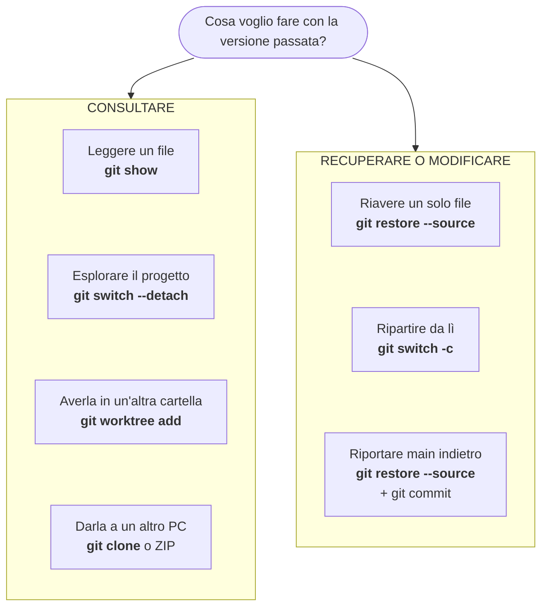
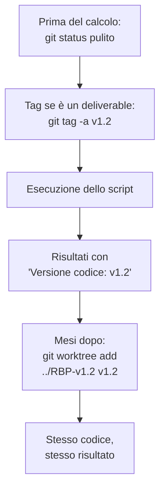
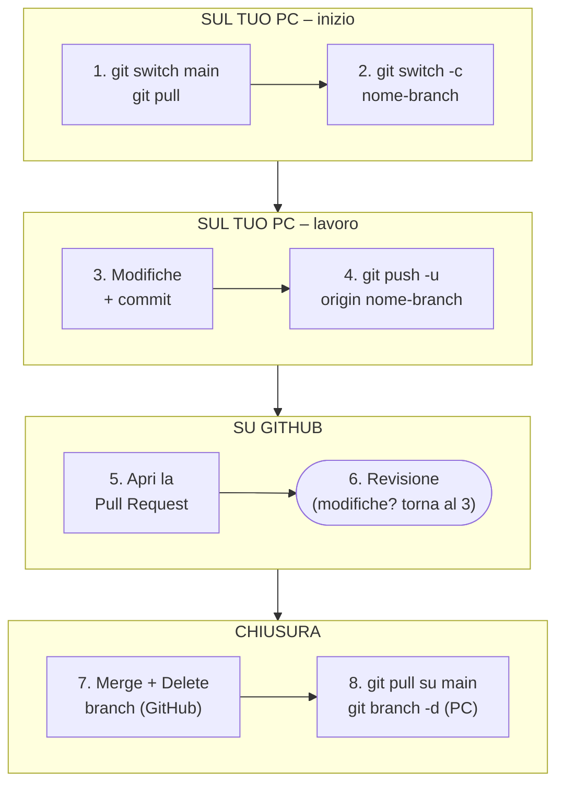
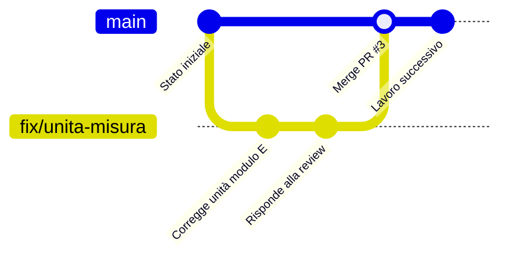

# Guida Git – Livello Intermedio

[[Git 0 - Indice|← Indice]] · [[Git 1 - Base|← Livello base]] · [[Git 3 - Avanzato|Livello avanzato →]]

Lavorare con la storia del progetto e con altre persone: etichettare le versioni, tornare a versioni passate, rendere riproducibili i calcoli, collaborare tramite Pull Request.

Prerequisito: i contenuti del [[Git 1 - Base|livello base]].

---

## 1. Tag (Etichettare le Versioni)

I tag servono a marcare un commit importante, ad esempio una versione dello script validata o consegnata.

* `git tag` – Elenca i tag esistenti.
* `git tag -a v1.0 -m "Versione validata"` – Crea un tag annotato sul commit corrente.
* `git tag -a v1.0 <hash> -m "..."` – Crea un tag su un commit passato.
* `git show v1.0` – Mostra il dettaglio del commit etichettato.
* `git push origin v1.0` – Invia un tag a GitHub (i tag **non** vengono inviati da un normale `git push`).
* `git push origin --tags` – Invia tutti i tag.
* `git checkout v1.0` – Esamina il progetto com'era in quella versione (detached HEAD, sola lettura).

---

## 2. Tornare a un Commit Passato ("Viaggio nel Tempo")

Git conserva **ogni versione** di ogni file committato. Per tornare indietro esistono molti comandi diversi, e all'inizio è facile confonderli. La domanda giusta da farsi non è "come torno indietro?", ma **"cosa voglio fare con la versione passata?"**.

### Mappa decisionale



I comandi completi sono spiegati nei paragrafi seguenti e riassunti nella tabella 2.10.

Nei paragrafi seguenti `a1b2c3d` indica l'hash (abbreviato) del commit a cui vuoi tornare. Al suo posto puoi usare anche un **tag** (es. `v1.0`) o la notazione relativa (es. `HEAD~3` = tre commit fa).

---

### 2.1 Trovare il commit giusto

Prima di tornare indietro bisogna sapere **dove** tornare.

* `git log --oneline` – Tutti i commit, uno per riga.
* `git log --oneline -- yang-shima/script.py` – Solo i commit che hanno modificato quel file.
* `git log --oneline --follow -- yang-shima/script.py` – Come sopra, ma segue il file anche se è stato rinominato.
* `git log --oneline -- yang-shima/` – Solo i commit che hanno toccato quella cartella.
* `git log --oneline --since="2026-09-01" --until="2026-09-30"` – Commit in un intervallo di date.
* `git log --oneline --grep="archimetro"` – Commit con quella parola **nel messaggio**.
* `git log --oneline -S "def archimetro"` – Commit in cui quel testo è **comparso o sparito dal codice** (utile per scoprire quando è stata introdotta o tolta una funzione).
* `git tag` – Elenca le versioni etichettate (vedi sezione 1).

> [!tip] Su GitHub
> Aprendo un file sul sito, il pulsante **History** mostra tutti i commit che lo hanno modificato, con data e messaggio. Cliccando su un commit vedi esattamente cosa è cambiato.

---

### 2.2 Consultare senza modificare nulla

Questi comandi **non toccano** né i tuoi file né lo storico: sono sempre sicuri.

* `git show a1b2c3d:yang-shima/script.py` – Stampa a schermo il file com'era in quel commit.
* `git show a1b2c3d:yang-shima/script.py > script_settembre.py` – Salva quella versione in un file separato, accanto a quello attuale.
* `git diff a1b2c3d -- yang-shima/script.py` – Mostra le differenze tra quella versione e il file attuale.
* `git ls-tree -r --name-only a1b2c3d` – Elenca tutti i file che esistevano in quel commit.

> [!note] Il percorso nel comando `git show`
> Dopo i due punti va scritto il percorso **a partire dalla cartella principale del repository** e con le barre `/`, anche su Windows. Esempio: `a1b2c3d:yang-shima/script.py`, non `a1b2c3d:script.py`.

---

### 2.3 Esplorare (ed eseguire) tutto il progetto com'era

```bash
git status                       # deve essere pulito: fai commit o git stash prima
git switch --detach a1b2c3d      # tutti i file tornano allo stato di quel commit
# ... guardi i file, lanci gli script, confronti i risultati ...
git switch main                  # torni al presente
```

Il comando equivalente meno recente è `git checkout a1b2c3d`.

**Cos'è il "detached HEAD".** Normalmente HEAD punta a un **branch**, e il branch punta all'ultimo commit. Quando fai `switch --detach`, HEAD punta **direttamente a un commit**, "staccato" da qualsiasi branch:

```text
Situazione normale (HEAD punta al branch, il branch all'ultimo commit):

                    HEAD
                     ↓
                    main
                     ↓
A ── B ── C ── D ── E

Detached HEAD (HEAD punta direttamente a un commit passato):

          HEAD
           ↓
A ── B ── C ── D ── E
                    ↑
                   main
```

In questo stato puoi leggere, eseguire e anche modificare i file, ma **i commit fatti qui non appartengono a nessun branch** e, tornando su `main`, diventano difficili da ritrovare (si recuperano solo con `git reflog`).

> [!warning] Hai modificato qualcosa in detached HEAD e vuoi tenerlo?
> Prima di tornare su `main`, crea un branch nel punto in cui ti trovi:
> `git switch -c nome-nuovo-branch`
> Così il lavoro resta al sicuro su quel branch.

---

### 2.4 Ripristinare un solo file

```bash
git restore --source=a1b2c3d -- yang-shima/script.py   # il file torna com'era
git diff                                                 # controlli la differenza
git add yang-shima/script.py
git commit -m "Ripristina script.py alla versione a1b2c3d"
```

* Il resto del progetto non cambia.
* Lo storico non viene cancellato: il ripristino diventa a sua volta un nuovo commit, quindi puoi sempre tornare alla versione di prima.
* Il `--` separa le opzioni dai nomi dei file. Non è obbligatorio, ma evita ambiguità.
* Comando equivalente meno recente: `git checkout a1b2c3d -- yang-shima/script.py` (che in più mette subito il file in Staging Area).

---

### 2.5 Lavorare a partire da una versione vecchia

Caso tipico: devi rifare un calcolo consegnato tempo fa **con lo script di allora**, e magari correggere un piccolo errore senza portarti dietro tutte le modifiche fatte nel frattempo.

```bash
git switch -c correzione-calcolo-settembre a1b2c3d
# ... modifichi, fai commit normalmente ...
```

* Il nuovo branch parte da `a1b2c3d`, non dall'ultimo commit.
* `main` resta intatto.
* Se la correzione serve anche nella versione attuale, puoi poi fare un merge del branch in `main` (risolvendo eventuali conflitti) oppure copiare solo il commit della correzione (*cherry-pick*, argomento della prossima espansione della guida).

---

### 2.6 Due versioni affiancate in due cartelle (`git worktree`)

È il modo più comodo per **lanciare la versione vecchia e quella nuova sugli stessi dati e confrontare i risultati**.

```bash
# dalla cartella del repository:
git worktree add ../RBP-settembre a1b2c3d      # crea una seconda cartella con la versione vecchia
git worktree add ../RBP-v1 v1.0                # oppure partendo da un tag
git worktree list                              # elenca le cartelle collegate
# ... lavori nelle due cartelle ...
git worktree remove ../RBP-settembre           # quando hai finito
```

* La seconda cartella è collegata allo **stesso repository**: non riscarica nulla da GitHub e condivide lo stesso storico.
* Il `../` crea la nuova cartella **accanto** al repository, non dentro. È importante: dentro comparirebbe come file non tracciato.
* La cartella vecchia è in *detached HEAD*. Se vuoi farci dei commit, creala direttamente con un branch: `git worktree add -b nome-branch ../cartella a1b2c3d`.
* Uno stesso branch può essere aperto in **una sola** cartella alla volta.

---

### 2.7 Clonare il repository a una versione specifica

Utile quando la versione vecchia serve **su un altro PC** o come copia completamente indipendente.

```bash
# Da un tag o da un branch: diretto
git clone --branch v1.0 https://github.com/UTENTE/NOME-REPO.git cartella-v1

# Da un hash: si clona normalmente, poi ci si sposta sul commit
git clone https://github.com/UTENTE/NOME-REPO.git cartella-vecchia
cd cartella-vecchia
git switch --detach a1b2c3d

# Solo quella versione, senza storico (più leggero)
git clone --depth 1 --branch v1.0 https://github.com/UTENTE/NOME-REPO.git cartella-v1
```

> [!info] Clone o worktree?
> - **Stesso PC, voglio confrontare due versioni:** `git worktree` (più veloce, nessun nuovo download).
> - **Altro PC, collega, archivio separato:** `git clone`.
>
> Questo è un buon motivo per usare i **tag**: `git clone --branch` funziona direttamente con un tag, ma non con un hash.

---

### 2.8 Scaricare una versione da GitHub senza usare Git

Per dare una versione vecchia a un collega che non usa Git:

* **Da un commit:** sul sito apri l'elenco dei commit (link *Commits* o *History*) → clicca sul commit → **Browse files** → pulsante **Code** → **Download ZIP**.
* **Da un tag:** pagina *Tags* (o *Releases*) del repository → **Source code (zip)**.

Lo ZIP contiene solo i file di quella versione, **senza** la cartella `.git` e quindi senza storico.

---

### 2.9 Riportare `main` a uno stato precedente (in modo permanente)

Vuoi che la versione attuale del progetto torni esattamente com'era a un certo commit, perché tutto ciò che è venuto dopo era sbagliato.

**Metodo consigliato: ripristino + nuovo commit (sicuro, non cancella lo storico)**

```bash
# dalla cartella PRINCIPALE del repository:
git restore --source=a1b2c3d --staged --worktree -- .
git status                                        # controlla cosa cambia
git commit -m "Riporta il progetto allo stato di a1b2c3d"
git push
```

* `--staged --worktree` aggiorna sia la Staging Area sia i file su disco.
* I file tracciati che non esistevano in `a1b2c3d` vengono rimossi; i file non tracciati non vengono toccati.
* Al posto di `.` puoi indicare una sola cartella, ad esempio `-- yang-shima/`, per riportare indietro **un solo progetto** lasciando invariati gli altri.
* Le modifiche intermedie restano nello storico: se cambi idea, puoi tornare avanti.

**Alternativa: `git revert`**

```bash
git revert --no-commit a1b2c3d..HEAD
git commit -m "Annulla le modifiche successive ad a1b2c3d"
```

`a1b2c3d..HEAD` significa "tutti i commit dopo `a1b2c3d`, fino all'ultimo". Il risultato è simile, ma se in quell'intervallo ci sono commit di merge `revert` si complica: in quel caso usa il metodo consigliato.

**Solo se i commit NON sono ancora su GitHub: `git reset --hard`**

```bash
git reset --hard a1b2c3d
```

Cancella i commit successivi dallo storico locale (vedi livello base, sezione *Annullamento e Ripristino*). Non usarlo mai su commit già pushati.

---

### 2.10 Riepilogo

| Voglio… | Comando | Modifica i file? | Modifica lo storico? |
| :--- | :--- | :--- | :--- |
| Leggere un file vecchio | `git show a1b2c3d:percorso/file` | No | No |
| Salvarne una copia | `git show a1b2c3d:percorso/file > copia.py` | Crea un file nuovo | No |
| Confrontarlo con l'attuale | `git diff a1b2c3d -- percorso/file` | No | No |
| Riavere un solo file | `git restore --source=a1b2c3d -- percorso/file` | Sì, un file | No (poi commit) |
| Esplorare tutto il progetto | `git switch --detach a1b2c3d` | Temporaneamente | No |
| Modificare da lì | `git switch -c nome a1b2c3d` | Sì, su un nuovo branch | Aggiunge un branch |
| Due versioni affiancate | `git worktree add ../cartella a1b2c3d` | Crea una cartella nuova | No |
| Copia su un altro PC | `git clone --branch v1.0 URL` | Crea una cartella nuova | No |
| Riportare `main` indietro | `git restore --source=a1b2c3d --staged --worktree -- .` + commit | Sì | Aggiunge un commit |
| Cancellare commit non pushati | `git reset --hard a1b2c3d` | Sì | **Sì, riscrive** |

---

## 3. Tracciabilità dei Calcoli

### Il problema
Un report di ottobre riporta un raggio di calandratura calcolato con uno script. A febbraio lo script è stato modificato dieci volte. Qualcuno chiede di rifare quel calcolo, o di capire perché oggi lo stesso input dà un risultato diverso. **Con quale versione del codice era stato fatto?**

Senza Git la risposta è "forse con `script_v3_finale.py`". Con Git può essere **esatta**, a patto di seguire due abitudini:

1. **Etichettare** con un tag le versioni usate per un risultato importante.
2. **Scrivere nei file dei risultati** la versione del codice che li ha prodotti.

---

### 3.1 Tag per ogni versione usata in un deliverable

Prima di lanciare i calcoli che finiranno in un report o in una consegna:

```bash
git status                                    # 1. tutto deve essere committato
git tag -a v1.2 -m "Versione usata per il report di ottobre"
git push origin v1.2                          # 2. il tag va inviato esplicitamente
```

Scegli uno schema di nomi e usalo sempre. Due esempi:
* **Numerato:** `v1.0`, `v1.1`, `v2.0` (il primo numero cambia quando cambiano i risultati in modo sostanziale, il secondo per correzioni e aggiunte).
* **Per consegna:** `report-2026-10`, `taratura-2026-11`.

Con un tag, tornare a quella versione è immediato: `git switch --detach v1.2`, oppure `git worktree add ../RBP-v1.2 v1.2` (vedi sezione 2).

---

### 3.2 Scrivere la versione del codice nei risultati

Il comando chiave è:

```bash
git describe --tags --always --dirty
```

Restituisce una stringa che identifica in modo univoco lo stato del codice:

| Risultato | Significato |
| :--- | :--- |
| `v1.2` | Il codice è **esattamente** alla versione con tag `v1.2` |
| `v1.2-3-ga1b2c3d` | 3 commit dopo `v1.2`; commit attuale `a1b2c3d` (la `g` iniziale sta per "git" e non fa parte dell'hash) |
| `a1b2c3d` | Nessun tag nello storico: solo l'hash del commit |
| `...-dirty` | Ci sono **modifiche non committate**: il risultato non è riproducibile con certezza |

#### Funzione Python da includere negli script

```python
import subprocess
from pathlib import Path


def versione_git():
    """Restituisce la versione del codice secondo Git (es. 'v1.2-3-ga1b2c3d-dirty').

    Se Git non è installato, o lo script non si trova dentro un repository,
    restituisce 'sconosciuta' invece di bloccare il calcolo.
    """
    cartella_script = Path(__file__).resolve().parent
    try:
        risultato = subprocess.run(
            ["git", "describe", "--tags", "--always", "--dirty"],
            cwd=cartella_script,
            capture_output=True,
            text=True,
            check=True,
        )
        return risultato.stdout.strip()
    except (OSError, subprocess.CalledProcessError):
        return "sconosciuta"
```

Spiegazione riga per riga:
* `Path(__file__).resolve().parent` – La cartella in cui si trova lo script. Serve perché Git deve essere eseguito **dentro** il repository, anche se lanci lo script da un'altra cartella (ad esempio da Isight).
* `subprocess.run([...])` – Esegue il comando `git describe ...` come se lo scrivessi nel terminale. Il comando va scritto come lista di parole.
* `cwd=cartella_script` – Esegue il comando in quella cartella (*current working directory*).
* `capture_output=True, text=True` – Cattura quello che il comando stampa e lo restituisce come testo, invece di mostrarlo a schermo.
* `check=True` – Se Git restituisce un errore, Python solleva un'eccezione.
* `.stdout.strip()` – Prende il testo prodotto e toglie l'"a capo" finale.
* `except (OSError, subprocess.CalledProcessError)` – `OSError` scatta se Git non è installato o non è nel PATH; `CalledProcessError` se la cartella non è un repository. In entrambi i casi la funzione restituisce `"sconosciuta"` e **il calcolo prosegue comunque**.

> [!note] Versione di Python
> `capture_output` e `text` richiedono **Python 3.7 o successivo**. Per script eseguiti con il Python interno di Abaqus fino alla versione 2023 (Python 2.7) serve una variante della funzione.

#### Esempio d'uso: intestazione del file dei risultati

```python
from datetime import datetime

with open("risultati.txt", "w", encoding="utf-8") as f:
    f.write(f"# Script: {Path(__file__).name}\n")
    f.write(f"# Versione codice: {versione_git()}\n")
    f.write(f"# Data esecuzione: {datetime.now():%Y-%m-%d %H:%M}\n")
    # ... da qui in poi i risultati ...
```

Il file dei risultati inizierà così:

```text
# Script: roll_bending_yang_shima.py
# Versione codice: v1.2-3-ga1b2c3d
# Data esecuzione: 2026-10-08 14:32
```

#### Esempio d'uso: versione stampata sui grafici

```python
fig.text(0.99, 0.01, f"codice: {versione_git()}", ha="right", va="bottom", fontsize=7, color="gray")
```

Aggiunge in basso a destra della figura matplotlib (`fig`) una piccola scritta con la versione: chi guarda il grafico, anche mesi dopo, sa da quale codice viene.

---

### 3.3 Il ciclo completo: dal risultato al codice



Dalla stringa scritta nei risultati si risale sempre al codice:
* `v1.2` → `git switch --detach v1.2`
* `v1.2-3-ga1b2c3d` → `git switch --detach a1b2c3d` (l'hash è la parte dopo la `g`)

> [!warning] Il suffisso `-dirty`
> Se nei risultati compare `-dirty`, il calcolo è stato fatto con modifiche **non committate**: non esiste nello storico una versione identica a quella usata. Per i calcoli "ufficiali", fai sempre commit **prima** di lanciarli.

> [!info] Il codice non basta
> Per riprodurre un risultato servono anche gli **stessi dati di input**: parametri, curve del materiale, geometria. Se questi file non sono nel repository (ad esempio perché esclusi dal `.gitignore`), archiviali insieme ai risultati.

---

## 4. Pull Request e Flusso di Lavoro Collaborativo

Nel [[Git 1 - Base#10. Gestione dei Branch (Rami di Sviluppo)|livello base (sezione 10)]] il merge si fa **in locale**, dal terminale. Quando si lavora in più persone, o quando si vuole un controllo prima di toccare `main`, il merge si fa invece **su GitHub**, tramite una **Pull Request**.

### Cos'è una Pull Request (PR)
* **Cos'è:** una **richiesta** di unire un branch in un altro (quasi sempre in `main`), fatta sul sito di GitHub.
* **Non è un comando Git:** è una funzione di GitHub. GitLab offre la stessa cosa con il nome di *Merge Request*.
* **Cosa raccoglie:** in una sola pagina trovi i commit del branch, le differenze riga per riga, la discussione, i commenti di revisione e l'esito dell'approvazione.
* **Perché "pull":** il nome è dal punto di vista di chi riceve le modifiche. Il significato è "per favore, tira (*pull*) le mie modifiche dentro il tuo branch".

> [!info] Serve anche se lavori da solo?
> Non è obbligatoria, ma è utile per tre motivi:
> - rileggi con calma **tutte** le modifiche prima di portarle in `main` (scheda *Files changed*);
> - lasci una traccia scritta del **perché** di una modifica importante;
> - quando arriverà un collega, il flusso sarà già quello giusto.

### Nuovi termini
* **Collaboratore:** persona a cui hai dato accesso in scrittura al repository (*Settings → Collaborators → Add people*). È possibile anche sui repository privati del piano gratuito.
* **Reviewer (revisore):** chi legge le modifiche e le approva o chiede correzioni.
* **Issue:** una scheda di lavoro sul repository (un bug, un'idea, un compito), identificata da un numero (es. `#12`). Si trova nella scheda *Issues*.
* **Fork:** una copia di un repository altrui nel tuo account GitHub. Si usa quando **non** hai i permessi di scrittura sul repository originale.
* **Upstream:** il repository originale da cui è stato fatto il fork.

### Due modelli di collaborazione

| | Repository condivisa | Fork |
| :--- | :--- | :--- |
| **Chi può fare push** | Tutti i collaboratori | Solo il proprietario del fork |
| **Dove nascono i branch** | Nello stesso repository | Nella propria copia (fork) |
| **Uso tipico** | Team aziendale, repository privato | Progetti open source |

Per un repository aziendale privato si usa quasi sempre la **repository condivisa**, che è anche il modello descritto nel resto di questa sezione.

### Il ciclo completo



Lo stesso flusso visto come linea temporale:



### Passo per passo

**1. Parti da `main` aggiornato**
```bash
git switch main
git pull
```

**2. Crea un branch con un nome descrittivo**
```bash
git switch -c fix/unita-misura-modulo
```
Convenzioni di nome diffuse (il `/` è solo una convenzione per raggruppare):

| Prefisso | Uso | Esempio |
| :--- | :--- | :--- |
| `feature/` | Nuova funzionalità | `feature/legge-materiale-tabellare` |
| `fix/` | Correzione di un errore | `fix/segno-curvatura-uscita` |
| `docs/` | Solo documentazione | `docs/how-to-isight` |
| `refactor/` | Riorganizzazione del codice senza cambiare i risultati | `refactor/funzioni-comuni` |

**3. Lavora e committa come al solito**
```bash
git add .
git commit -m "Corregge unità di misura del modulo elastico (MPa)"
```

**4. Pubblica il branch su GitHub**
```bash
git push -u origin fix/unita-misura-modulo
```

**5. Apri la Pull Request su GitHub**
1. Vai sulla pagina del repository: compare un banner giallo con il pulsante **Compare & pull request**. In alternativa: scheda **Pull requests → New pull request**.
2. Controlla le due tendine in alto: **base:** `main` ← **compare:** il tuo branch. Si legge "porta le modifiche di *compare* dentro *base*".
3. Scrivi un **titolo** chiaro e una **descrizione** (vedi il modello più sotto).
4. Sulla destra, in **Reviewers**, scegli chi deve rivedere.
5. Clicca **Create pull request**.

> [!tip] Draft Pull Request
> Con la freccia accanto al pulsante puoi scegliere **Create draft pull request**: la PR è visibile ma segnata come "lavoro in corso" e non può essere unita. Quando è pronta, clicca **Ready for review**.

**6. Revisione**
La pagina della PR ha tre schede principali:
* **Conversation:** la discussione generale e lo storico degli eventi.
* **Commits:** l'elenco dei commit del branch.
* **Files changed:** le differenze riga per riga. Passando sopra una riga compare un **`+`** blu: cliccandolo si lascia un commento su quella riga precisa.

Il revisore conclude con **Review changes** e sceglie una di tre opzioni:
* **Comment:** solo commenti, senza giudizio finale.
* **Approve:** approva le modifiche.
* **Request changes:** chiede correzioni prima del merge.

Nota: non puoi approvare una tua stessa Pull Request.

**7. Aggiornare la PR dopo i commenti**
Non serve aprire una nuova PR: basta fare nuovi commit **sullo stesso branch** e un `git push`. La PR si aggiorna da sola.

**8. Merge su GitHub**
Quando la PR è approvata, il pulsante verde offre tre modalità:

| Modalità | Cosa succede in `main` | Quando usarla |
| :--- | :--- | :--- |
| **Create a merge commit** | Tutti i commit del branch + un commit di merge | Predefinita: conserva lo storico completo |
| **Squash and merge** | Tutti i commit del branch compressi in **un solo** commit | Storico di `main` più pulito: un commit per PR |
| **Rebase and merge** | I commit vengono ricopiati in fila su `main`, senza commit di merge | Avanzata: meglio evitarla all'inizio |

Scegli una modalità e usa sempre quella. Dopo il merge, clicca **Delete branch**: il branch su GitHub non serve più.

**9. Pulizia locale**
```bash
git switch main
git pull                                  # scarica il merge appena fatto su GitHub
git branch -d fix/unita-misura-modulo     # elimina il branch locale
git fetch --prune                         # rimuove i riferimenti ai branch già cancellati su GitHub
```

> [!warning] Dopo uno "Squash and merge"
> `git branch -d` può rifiutarsi dicendo che il branch *non è stato integrato* (`not fully merged`). Succede perché lo squash crea un commit nuovo, diverso dai tuoi. Se su GitHub la PR risulta **Merged**, puoi eliminare il branch in sicurezza con `git branch -D`.

### Conflitti in una Pull Request
Se mentre lavoravi qualcun altro ha modificato le stesse righe in `main`, GitHub mostra il messaggio *This branch has conflicts that must be resolved*. Si risolve in locale:

```bash
git switch fix/unita-misura-modulo
git pull origin main          # porta le novità di main nel tuo branch: qui emergono i conflitti
# risolvi i conflitti come nel livello base (sezione 11), poi:
git add nome_file
git commit -m "Risolve conflitti con main"
git push                      # la PR si aggiorna e il conflitto sparisce
```

Per conflitti semplici, GitHub offre anche il pulsante **Resolve conflicts**, che apre un editor direttamente nel browser.

### Collegare una PR a una Issue
Se nella descrizione della PR scrivi `Closes #12` (oppure `Fixes #12` o `Resolves #12`), l'issue numero 12 si chiude automaticamente quando la PR viene unita in `main`.

### Come scrivere una buona Pull Request
Modello di descrizione:

```markdown
## Cosa cambia
Breve elenco delle modifiche.

## Perché
Il problema o l'obiettivo che ha motivato la modifica.

## Come è stato verificato
Prove eseguite, casi di confronto, risultati attesi e ottenuti.

## Note per il revisore
Punti su cui serve particolare attenzione.
```

> [!tip] Template automatico
> Se salvi questo modello nel repository come `.github/pull_request_template.md`, GitHub lo inserisce automaticamente in ogni nuova Pull Request.

Buone pratiche:
* **PR piccole e con un solo scopo:** una PR da 50 righe viene letta davvero, una da 2000 no.
* **Rileggi tu per primo** la scheda *Files changed* prima di chiedere la revisione.
* **Non mischiare** modifiche di formattazione e modifiche di logica nella stessa PR.
* **Rispondi ai commenti** con nuovi commit sullo stesso branch, non con una nuova PR.

### Regole di team (da concordare)
* Nessuno fa commit direttamente su `main`: **tutto passa da una Pull Request**.
* Un branch per ogni attività, con vita breve (giorni, non mesi).
* `git pull` su `main` prima di creare un nuovo branch.
* Il branch si cancella dopo il merge.

> [!note] Proteggere `main`
> GitHub può **impedire tecnicamente** i push diretti su `main` e richiedere un'approvazione prima del merge (*Settings → Branches* oppure *Settings → Rules → Rulesets*). Sui repository **privati** questa funzione richiede un piano a pagamento (GitHub Pro, Team o superiori). Con il piano gratuito resta una regola da rispettare per accordo.

### GitHub CLI (opzionale)
Lo strumento `gh` permette di gestire le Pull Request dal terminale. Va installato a parte e collegato all'account con `gh auth login`.

* `gh pr create` – Apre una Pull Request dal branch corrente (chiede titolo e descrizione).
* `gh pr list` – Elenca le Pull Request aperte.
* `gh pr checkout 12` – Scarica in locale il branch della PR numero 12, per provarla.
* `gh pr merge 12` – Esegue il merge della PR numero 12.

---

## 5. Prossimi Argomenti di questo Livello

Argomenti previsti per completare il livello intermedio:

* **`rebase`** – riordinare i commit e "riallineare" un branch a `main`; `rebase -i` per ripulire i commit prima di una Pull Request.
* **Configurazione di `git pull`** – merge o rebase, e il messaggio *"You have divergent branches"*.
* **`cherry-pick`** – copiare un singolo commit da un branch a un altro.
* **Clone superficiale, parziale e sparse checkout** – scaricare solo una parte di un repository.
* **`git bisect`** – trovare automaticamente il commit che ha introdotto un errore o cambiato un risultato.
* **`.gitattributes`** – fine riga e file binari.
* **Git LFS** – versionare file di grandi dimensioni.
* **Alias** – scorciatoie per i comandi lunghi.
* **VS Code** – pannello Source Control, estensioni (Git Graph, GitLens, GitHub Pull Requests) e configurazione.
* **GitHub** – Release, Issues, template.
* **Chiavi SSH** – autenticazione senza password.

---

[[Git 0 - Indice|← Indice]] · [[Git 1 - Base|← Livello base]] · [[Git 3 - Avanzato|Livello avanzato →]]
