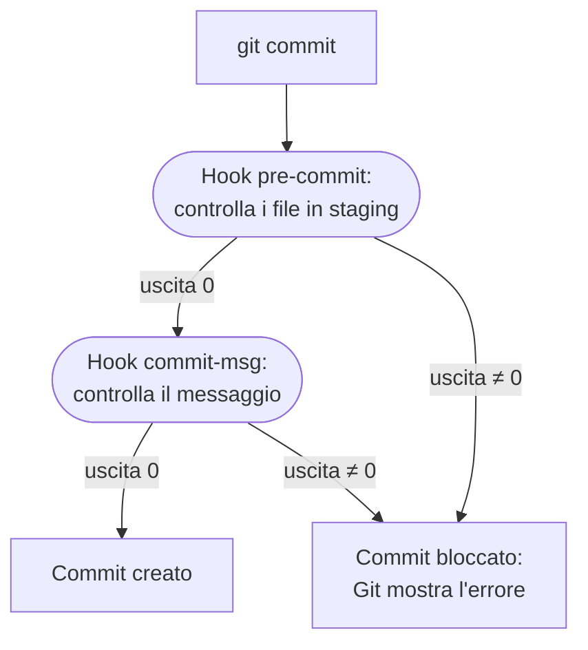
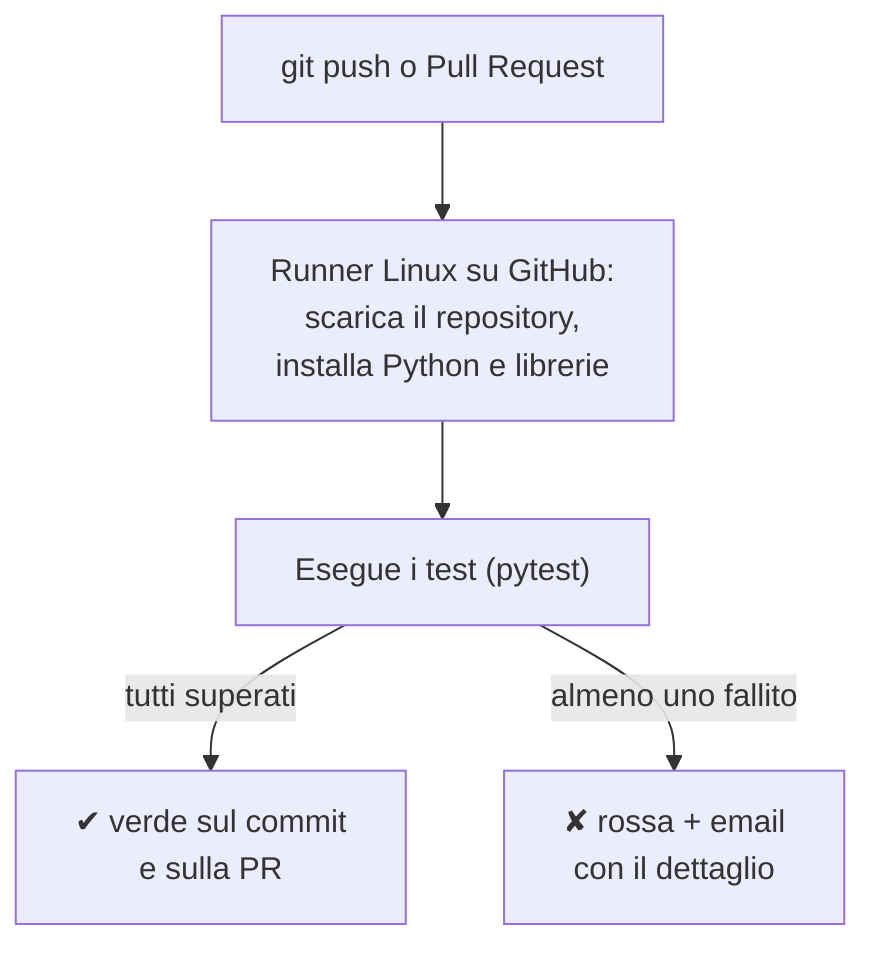
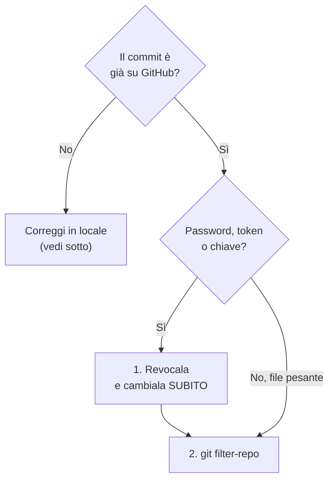
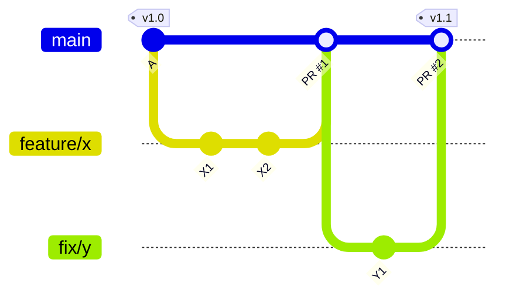
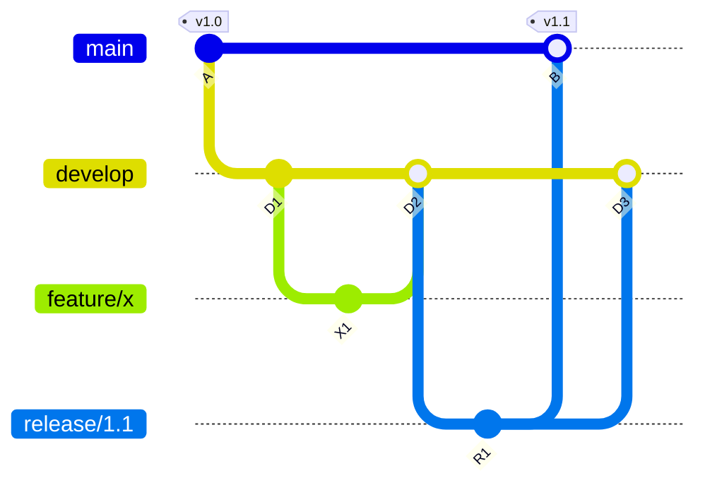
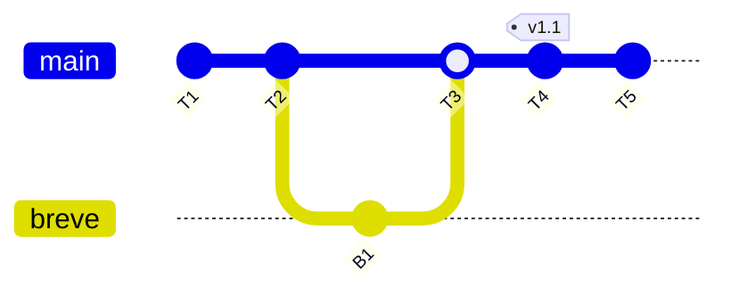
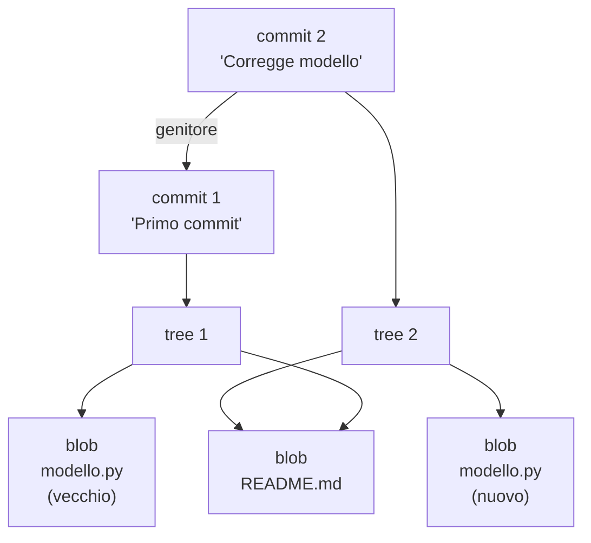
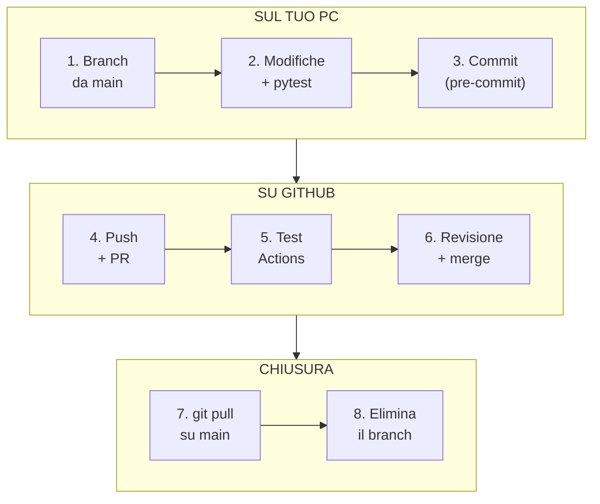

# Guida Git – Livello Avanzato

[[Git 0 - Indice|← Indice]] · [[Git 2 - Intermedio|← Livello intermedio]]

Automatizzare i controlli, correggere errori gravi nello storico, condividere codice tra repository, scegliere un modello di lavoro e capire come Git funziona "sotto il cofano".

Prerequisito: i contenuti dei livelli [[Git 1 - Base|base]] e [[Git 2 - Intermedio|intermedio]].

> [!tip] Come leggere questo livello
> Ogni sezione risponde a quattro domande: **che cos'è**, **quando serve**, **come si usa** (comandi ed esempi) e **cosa può andare storto**. La sezione 8 mette insieme gli strumenti in **workflow completi**, pronti da seguire passo per passo.
>
> Non tutto serve subito. Ordine consigliato per un progetto di script di calcolo:
> 1. **Hook e pre-commit** (sezione 1): evitano gli errori prima che entrino nello storico.
> 2. **GitHub Actions** (sezione 2): verificano che i risultati non cambino senza volerlo.
> 3. **Strategie di branching** (sezione 5): danno un metodo al lavoro.
> 4. Il resto quando se ne presenta l'occasione.

> [!note] Convenzioni
> - `a1b2c3d` indica un hash di commit di esempio.
> - `<utente>` e `NOME-REPO` vanno sostituiti con i valori reali.
> - Gli output mostrati nei blocchi di testo sono **esempi**: gli hash reali saranno diversi.

---

## 1. Hook e Framework pre-commit

### 1.1 Che cos'è un hook
Un **hook** ("gancio") è uno script che Git esegue **automaticamente** in un momento preciso: prima di un commit, prima di un push, dopo un checkout, e così via.

La regola è semplice:
* se lo script termina con codice di uscita **0**, Git prosegue;
* se termina con un codice **diverso da 0**, Git **blocca l'operazione**.

Gli hook servono quindi a fare da "guardiano": impediscono che un errore entri nello storico, invece di doverlo correggere dopo.



### 1.2 Gli hook più utili

| Hook | Quando viene eseguito | Uso tipico |
| :--- | :--- | :--- |
| `pre-commit` | Prima di creare il commit | Bloccare file pesanti, password, errori di sintassi; formattare il codice |
| `commit-msg` | Dopo aver scritto il messaggio | Imporre un formato al messaggio di commit |
| `pre-push` | Prima di inviare a GitHub | Lanciare i test: se falliscono, il push non parte |
| `post-checkout` | Dopo un `switch` o `checkout` | Avvisi o pulizie automatiche |
| `post-merge` | Dopo un `merge` o `pull` riuscito | Es. reinstallare le dipendenze se sono cambiate |

Questi sono hook **lato client**, cioè sul tuo PC. Su GitHub i controlli lato server si fanno con GitHub Actions (sezione 2).

### 1.3 Scrivere un hook a mano

Gli hook vivono nella cartella `.git/hooks/`. Git ci mette già degli esempi con estensione `.sample`, che sono **disattivati**: un hook è attivo solo se il file ha **esattamente** il nome dell'hook, senza estensione.

Esempio: un hook `pre-commit` che blocca i file più grandi di 5 MB (tipicamente un `.odb` sfuggito al `.gitignore`).

Crea il file `.git/hooks/pre-commit` (senza estensione) con questo contenuto:

```sh
#!/bin/sh
# pre-commit: blocca i file in staging piu' grandi di 5 MB

limite=5242880      # 5 MB espressi in byte (5 * 1024 * 1024)
errore=0

# elenco dei file aggiunti (A) o modificati (M) in Staging Area
for file in $(git diff --cached --name-only --diff-filter=AM); do
    dim=$(wc -c < "$file")
    if [ "$dim" -gt "$limite" ]; then
        echo "ERRORE: $file pesa $dim byte (limite 5 MB)"
        errore=1
    fi
done

exit $errore
```

Spiegazione:
* `#!/bin/sh` – Indica che lo script va eseguito con la shell. Su Windows funziona perché Git for Windows esegue gli hook con la shell di Git Bash.
* `git diff --cached --name-only --diff-filter=AM` – Elenca solo i **nomi** dei file in Staging Area che sono stati **aggiunti** o **modificati**.
* `wc -c < "$file"` – Conta i byte del file.
* `exit $errore` – Restituisce 0 se tutto è a posto, 1 se almeno un file supera il limite: in quel caso il commit viene bloccato.

Note:
* **Permessi:** su Windows con Git for Windows basta creare il file. Su Linux e macOS va reso eseguibile con `chmod +x .git/hooks/pre-commit`.
* **Limiti dell'esempio:** non gestisce nomi di file con spazi e misura il file su disco, non la versione in staging. Per un uso semplice va bene.
* **Scavalcare il controllo:** `git commit --no-verify` salta gli hook `pre-commit` e `commit-msg`. Usalo solo se sai esattamente perché.

> [!warning] Gli hook in `.git/hooks/` non vengono condivisi
> La cartella `.git` non viene inviata a GitHub. Un hook scritto lì vale **solo sul tuo PC**: un collega che clona il repository non lo riceve.
> Due soluzioni:
> - **`core.hooksPath`**: metti gli hook in una cartella versionata (es. `.githooks/`) e ognuno, dopo il clone, esegue una volta `git config core.hooksPath .githooks`.
> - **Il framework `pre-commit`** (paragrafo seguente): la soluzione più diffusa.

### 1.4 Il framework pre-commit

[pre-commit](https://pre-commit.com) è un programma Python che **gestisce gli hook al posto tuo**:
* la configurazione sta in un file versionato, `.pre-commit-config.yaml`, quindi è condivisa con tutti;
* invece di scrivere script, scegli controlli già pronti da un catalogo;
* scarica e installa da solo gli strumenti necessari.

**Installazione (una tantum per PC):**
```bash
pip install pre-commit
pre-commit --version
```

**Configurazione del repository.** Crea nella cartella principale il file `.pre-commit-config.yaml`:

```yaml
# .pre-commit-config.yaml
repos:
  # Controlli generici, gia' pronti
  - repo: https://github.com/pre-commit/pre-commit-hooks
    rev: v5.0.0
    hooks:
      - id: check-added-large-files   # blocca file troppo grandi
        args: ["--maxkb=5000"]        # limite: 5000 KB
      - id: check-merge-conflict      # blocca marcatori <<<<<<< dimenticati
      - id: detect-private-key        # blocca chiavi private
      - id: check-ast                 # verifica la sintassi Python
      - id: end-of-file-fixer         # un solo "a capo" a fine file
      - id: trailing-whitespace       # toglie gli spazi a fine riga

  # Ruff: controllo e formattazione del codice Python
  - repo: https://github.com/astral-sh/ruff-pre-commit
    rev: v0.6.9
    hooks:
      - id: ruff                      # segnala errori e import inutili
        args: ["--fix"]               # corregge quelli sicuri
      - id: ruff-format               # formatta il codice

# Cartelle escluse da TUTTI i controlli (espressione regolare)
exclude: "(^|/)archivio/"
```

**Attivazione nel repository (una tantum per ogni clone):**
```bash
pre-commit install            # collega pre-commit all'hook di Git
pre-commit autoupdate         # aggiorna "rev" all'ultima versione
pre-commit run --all-files    # prima esecuzione su tutto il repository
```

Da quel momento ogni `git commit` esegue automaticamente i controlli **sui file in Staging Area**.

**Come si legge il risultato:**

```text
check for added large files..............................Passed
check for merge conflicts................................Passed
detect private key.......................................Passed
check python ast.........................................Passed
fix end of files.........................................Failed
- hook id: end-of-file-fixer
- exit code: 1
- files were modified by this hook

Fixing yang-shima/roll_bending.py
```

* **Passed:** controllo superato.
* **Failed + "files were modified":** il controllo ha **corretto da solo** il file, ma il commit è stato bloccato perché il file in staging non è più quello corretto. Basta rifare `git add` e `git commit`.
* **Failed senza modifiche:** c'è un problema da correggere a mano, descritto nel messaggio.

> [!warning] Attenzioni pratiche
> - **Prima formattazione:** `ruff-format` riformatta tutto il codice esistente. Fai la prima esecuzione (`pre-commit run --all-files`) in un **commit dedicato**, ad esempio "Applica formattazione automatica", senza altre modifiche: così il diff delle modifiche vere resta leggibile.
> - **Script per Abaqus o Isight in Python 2 / Jython:** `check-ast` e Ruff usano Python 3 e segnalerebbero errori su codice Python 2 corretto. Escludi quelle cartelle aggiungendole a `exclude`, ad esempio `"(^|/)(archivio|script_abaqus)/"`.
> - **Partire per gradi:** se Ruff segnala troppi problemi sul codice esistente, commenta il suo blocco con `#` e attiva prima solo i controlli generici.
> - **Rete aziendale:** la prima esecuzione scarica gli strumenti da GitHub. Se un proxy aziendale lo impedisce, serve configurare il proxy per `pip` e `git`.

---

## 2. GitHub Actions e Test Automatici

### 2.1 Che cos'è
**GitHub Actions** è il servizio di *Continuous Integration* (CI) di GitHub: a ogni `push` o Pull Request, GitHub avvia un computer virtuale (*runner*), scarica il repository ed esegue i comandi che hai scritto in un file di configurazione, il **workflow**.

L'esito compare come una spunta verde ✔ o una croce rossa ✘ accanto a ogni commit e in ogni Pull Request.

Gli hook (sezione 1) controllano **il tuo PC**, e possono essere scavalcati con `--no-verify`. GitHub Actions controlla **il repository condiviso**, sempre, per tutti.



### 2.2 Quando serve in un progetto di calcolo
Il caso più prezioso è il **test di regressione**: verificare automaticamente che, dopo una modifica, lo script dia **ancora gli stessi risultati** su un insieme di casi di riferimento già validati (con prove sperimentali o FEM).

Se una modifica pensata per "sistemare il codice" cambia un raggio di calandratura del 2%, lo scopri subito, sulla Pull Request, invece che mesi dopo in un report.

> [!info] Costi e limiti
> - Sui repository **privati** il piano gratuito include un numero limitato di minuti di esecuzione al mese (attualmente 2.000 minuti sui runner Linux). Per test di script Python bastano ampiamente.
> - I runner Windows consumano i minuti più velocemente: per codice Python puro usa `ubuntu-latest`.
> - **Abaqus e Isight non sono disponibili** sui runner di GitHub (servono licenze e installazione). Si possono testare solo le parti in **Python puro**: modelli analitici, leggi del materiale, post-processing di file di testo.

### 2.3 Prerequisito: codice "testabile"
Perché uno script sia testabile, il calcolo deve essere **richiamabile come funzione**, separato dalla parte che legge input, disegna grafici e scrive file. La struttura tipica è:

```python
# roll_bending_yang_shima.py

def calcola_raggio(spessore, larghezza, corsa, materiale):
    """Calcolo puro: riceve numeri, restituisce numeri."""
    ...
    return raggio


def main():
    """Parte 'operativa': input, grafici, file di output."""
    raggio = calcola_raggio(10.0, 1500.0, 45.0, "S355")
    print(raggio)


if __name__ == "__main__":
    main()
```

* `if __name__ == "__main__":` significa "esegui `main()` **solo** se lo script viene lanciato direttamente". Se invece il file viene **importato** da un test, il calcolo non parte da solo e il test può richiamare `calcola_raggio` con i suoi valori.
* **Percorsi:** il runner è Linux. Percorsi assoluti di Windows (`C:\Users\...`) scritti nel codice lo fanno fallire. Usa percorsi relativi alla cartella dello script, ad esempio `Path(__file__).parent / "dati.csv"`.
* **Grafici:** sul runner non c'è uno schermo. `plt.show()` va chiamato solo dentro `main()`, mai nella funzione di calcolo.

### 2.4 Scrivere un test di regressione con pytest

**1. I casi di riferimento**, in un file JSON (`tests/riferimenti_yang_shima.json`). I valori di `raggio_atteso` si ottengono eseguendo **una volta** la versione validata dello script:

```json
[
  {
    "nome": "S355_sp10_corsa45",
    "input": {"spessore": 10.0, "larghezza": 1500.0,
              "corsa": 45.0, "materiale": "S355"},
    "raggio_atteso": 1234.567
  },
  {
    "nome": "S355_sp20_corsa60",
    "input": {"spessore": 20.0, "larghezza": 1500.0,
              "corsa": 60.0, "materiale": "S355"},
    "raggio_atteso": 2345.678
  }
]
```

*(I nomi dei parametri e i valori sono di esempio: vanno adattati alla funzione reale.)*

**2. Il test** (`tests/test_regressione_yang_shima.py`):

```python
import json
from pathlib import Path

import pytest

from roll_bending_yang_shima import calcola_raggio

FILE_RIF = Path(__file__).parent / "riferimenti_yang_shima.json"


def carica_casi():
    with open(FILE_RIF, encoding="utf-8") as f:
        return json.load(f)


@pytest.mark.parametrize("caso", carica_casi(),
                         ids=lambda c: c["nome"])
def test_raggio_invariato(caso):
    raggio = calcola_raggio(**caso["input"])
    atteso = caso["raggio_atteso"]
    assert raggio == pytest.approx(atteso, rel=1e-6)
```

Spiegazione:
* `@pytest.mark.parametrize(...)` – Esegue lo stesso test **una volta per ogni caso** del file JSON. `ids=` dà a ogni esecuzione il nome del caso, così nel report vedi quale ha fallito.
* `calcola_raggio(**caso["input"])` – I due asterischi "spacchettano" il dizionario: le chiavi diventano i nomi dei parametri della funzione.
* `pytest.approx(atteso, rel=1e-6)` – Confronto con tolleranza **relativa** di un milionesimo. I numeri in virgola mobile possono differire nelle ultime cifre tra PC diversi o versioni diverse di NumPy: un confronto con `==` esatto fallirebbe senza motivo. Se il calcolo usa un risolutore iterativo, scegli una tolleranza coerente con la sua precisione (es. `rel=1e-4`).

**3. Dire a pytest dove trovare gli script.** Le cartelle del repository contengono un trattino (`yang-shima`) e non possono essere importate come pacchetti Python. Si indica la cartella in un file `pyproject.toml` nella radice del repository:

```toml
[tool.pytest.ini_options]
pythonpath = ["yang-shima"]
testpaths = ["tests"]
```

**4. Prova in locale** prima di affidarti a GitHub:
```bash
pip install pytest
pytest -v
```

> [!warning] Quando i risultati cambiano **di proposito**
> Se correggi un errore nel modello, il test di regressione **deve** fallire: i risultati cambiano. In quel caso aggiorna i valori di riferimento nel file JSON **nello stesso commit** della correzione, e spiega nel messaggio perché sono cambiati. Così lo storico documenta ogni variazione dei risultati.

### 2.5 Il file di workflow
Crea il file `.github/workflows/test.yml` (le cartelle `.github` e `workflows` vanno create a mano):

```yaml
name: Test calcoli

on:
  push:
    branches: [main]      # a ogni push su main
  pull_request:           # a ogni Pull Request
  workflow_dispatch:      # pulsante "Run workflow" manuale

jobs:
  test:
    runs-on: ubuntu-latest
    env:
      MPLBACKEND: Agg     # matplotlib senza schermo
    steps:
      - name: Scarica il repository
        uses: actions/checkout@v4

      - name: Installa Python
        uses: actions/setup-python@v5
        with:
          python-version: "3.12"

      - name: Installa le librerie
        run: pip install numpy scipy matplotlib pytest

      - name: Esegui i test
        run: pytest -v
```

Spiegazione:
* `on:` – **Quando** eseguire il workflow.
* `runs-on: ubuntu-latest` – Il tipo di computer virtuale.
* `steps:` – I passi, eseguiti in ordine. Se uno fallisce, i successivi non partono e l'esito è ✘.
* `uses:` – Usa un'*action* già pronta (scaricare il repository, installare Python). `run:` esegue un comando come nel terminale.
* `MPLBACKEND: Agg` – Fa funzionare matplotlib senza interfaccia grafica.
* **Versione di Python:** usa la stessa che usi sul tuo PC.

Dopo il `git push`, l'esecuzione si segue nella scheda **Actions** del repository. Cliccando su un'esecuzione e poi su un passo, vedi l'output completo, come nel terminale.

> [!tip] Aggiungere i controlli pre-commit al workflow
> Così vengono eseguiti anche per chi non ha installato pre-commit sul proprio PC. Aggiungi in fondo agli `steps`:
> ```yaml
>       - name: Controlli pre-commit
>         run: |
>           pip install pre-commit
>           pre-commit run --all-files
> ```

> [!note] Rendere i test obbligatori
> Su GitHub si può impostare che una Pull Request **non possa essere unita** finché i test non sono verdi (*Settings → Branches* o *Rulesets*, opzione *Require status checks to pass*). Come per la protezione di `main` (livello intermedio), sui repository privati questa funzione richiede un piano a pagamento. Con il piano gratuito resta la regola: **non si fa merge con la croce rossa**.

---

## 3. Riscrittura dello Storico con git filter-repo

### 3.1 Il problema
Hai committato per errore un file pesante (un `.odb` da 300 MB) o un file con una password, e lo hai già inviato a GitHub. Cancellarlo con un nuovo commit **non basta**: il file resta nello storico, nei commit precedenti. Il repository resta pesante e la password resta leggibile da chiunque abbia accesso.

L'unica soluzione è **riscrivere lo storico**: ricreare tutti i commit come se quel file non fosse mai esistito.

```text
Prima:  A ─── B ─── C ─── D        (B contiene modello.odb)

Dopo:   A ─── B' ── C' ── D'       (da B in poi: commit nuovi,
                                    hash nuovi, senza modello.odb)
```

Il commit `A` non cambia. Da `B` in poi **tutti** gli hash cambiano, perché l'hash di un commit dipende dal suo contenuto e da quello del commit precedente (vedi sezione 6).

### 3.2 Prima di tutto: serve davvero?



**Se il commit è solo sul tuo PC:**
* il file è nell'**ultimo** commit: `git rm --cached nome_file`, poi `git commit --amend`;
* il file è in un commit **più vecchio**: `git filter-repo` funziona anche su un repository solo locale (passi 3–5 della procedura).

> [!danger] Password o token: prima si revocano
> Una credenziale finita su GitHub va considerata **compromessa**, anche se il repository è privato e anche se la rimuovi dopo pochi minuti: può essere già stata copiata da un clone, da un fork o da una cache. **Cambia la password o revoca il token per primo**; riscrivere lo storico viene dopo e serve solo a fare pulizia.

### 3.3 Installazione
`git filter-repo` non è incluso in Git: è uno script Python.
```bash
pip install git-filter-repo
git filter-repo --version
```
Se il secondo comando non viene trovato, la cartella `Scripts` di Python non è nel PATH: la soluzione più semplice è reinstallare Python spuntando l'opzione *Add Python to PATH*.

> [!note] Comandi da evitare
> Su internet si trovano ancora guide basate su `git filter-branch`: è lento e pieno di trappole, e la documentazione ufficiale di Git stessa sconsiglia di usarlo. Un'alternativa valida, ma meno flessibile, è **BFG Repo-Cleaner** (richiede Java).

### 3.4 La procedura completa

**Passo 1 – Backup completo del repository**, in una cartella separata. `--mirror` copia tutto: branch, tag e riferimenti.
```bash
cd /c/Users/<utente>/Progetti
git clone --mirror https://github.com/UTENTE/NOME-REPO.git backup-repo.git
```

**Passo 2 – Clone nuovo su cui lavorare.** `git filter-repo` si rifiuta di lavorare su un clone già usato: è una protezione voluta.
```bash
git clone https://github.com/UTENTE/NOME-REPO.git repo-pulizia
cd repo-pulizia
```

**Passo 3 – (Facoltativo) Analisi:** trova i file più pesanti di tutto lo storico.
```bash
git filter-repo --analyze
```
I risultati sono in `.git/filter-repo/analysis/`. Il file `path-all-sizes.txt` elenca tutti i file mai esistiti, ordinati per dimensione.

**Passo 4 – Riscrittura.** Scegli il comando adatto al caso:

| Caso | Comando |
| :--- | :--- |
| Rimuovere **un file** specifico | `git filter-repo --invert-paths --path yang-shima/modello.odb` |
| Rimuovere **una cartella** | `git filter-repo --invert-paths --path risultati/` |
| Rimuovere tutti i file di **un tipo** | `git filter-repo --invert-paths --path-glob '*.odb'` |
| Rimuovere tutti i file **sopra una dimensione** | `git filter-repo --strip-blobs-bigger-than 10M` |
| **Sostituire un testo** (es. una password) in tutti i file | `git filter-repo --replace-text sostituzioni.txt` |

* `--path` indica cosa selezionare; `--invert-paths` significa "tieni tutto **tranne** questo".
* Per `--replace-text`, crea **fuori dal repository** un file `sostituzioni.txt` con una riga per ogni testo da sostituire:
  ```text
  PasswordSegreta123==>***RIMOSSA***
  ```
  A sinistra di `==>` il testo da cercare, a destra quello da scrivere al suo posto.

**Passo 5 – Verifica:** il file non deve più comparire.
```bash
git log --oneline --all -- yang-shima/modello.odb   # nessun risultato
git count-objects -vH                               # dimensione ridotta
```

**Passo 6 – Ricollegare GitHub e forzare l'invio.** Per sicurezza `filter-repo` **rimuove** il collegamento `origin`: va rimesso a mano.
```bash
git remote add origin https://github.com/UTENTE/NOME-REPO.git
git push origin --force --all     # tutti i branch
git push origin --force --tags    # tutti i tag
```

`--force` sovrascrive lo storico su GitHub con quello nuovo. È l'unico caso in cui un push forzato su `main` è giustificato.

**Passo 7 – Tutti gli altri cloni vanno sostituiti.** Ogni copia del repository (su altri PC, dei colleghi, le cartelle `worktree`) contiene ancora il vecchio storico. **Non va fatto `git pull`**: mescolerebbe storia vecchia e nuova e riporterebbe il file. Bisogna cancellare la vecchia cartella e fare un nuovo `git clone`.

### 3.5 Conseguenze da conoscere

> [!warning] Gli hash cambiano: attenzione alla tracciabilità
> Le stringhe di versione scritte nei file dei risultati (livello intermedio, sezione 3) contengono gli **hash vecchi**, che dopo la riscrittura non esistono più. Due protezioni:
> - `filter-repo` salva la corrispondenza vecchio → nuovo hash nel file `.git/filter-repo/commit-map`. **Copialo e conservalo** insieme al backup.
> - I **tag** vengono riscritti e mantengono il loro nome: un risultato etichettato `v1.2` resta rintracciabile. Un motivo in più per usare i tag sulle versioni importanti.

* Le Pull Request già chiuse su GitHub conservano i riferimenti ai vecchi commit. Per dati davvero sensibili, GitHub indica nella sua documentazione la procedura per richiedere la rimozione completa al supporto.
* **Prevenzione:** quasi sempre il problema si evita a monte con un buon `.gitignore` e con i controlli `check-added-large-files` e `detect-private-key` di pre-commit (sezione 1).

---

## 4. Submodule e Subtree

### 4.1 Il problema
Una parte del codice serve a **più repository**. Esempio: una libreria delle leggi del materiale (`legge_sezione.py`, curve sforzo-deformazione) usata sia dai modelli di calandratura a tre rulli sia da un futuro repository sulla calandratura a quattro rulli.

Copiare il file a mano in ogni repository porta presto a versioni diverse dello stesso codice, con correzioni fatte in un posto e non nell'altro. Git offre due strumenti per condividerlo in modo controllato: **submodule** e **subtree**.

> [!tip] Prima di tutto: serve davvero?
> Finché tutto il codice sta in **un solo repository** (come `Roll-Bending-Python`, con le sue tre cartelle), il codice comune si condivide semplicemente con una cartella, ad esempio `comune/`, da cui gli script importano. Submodule e subtree servono solo quando il codice condiviso deve vivere in un **repository separato**.

### 4.2 Submodule: un "collegamento" a un altro repository

Un submodule è una cartella del repository principale che contiene **un altro repository Git**. Il repository principale non salva i file della libreria: salva solo **a quale commit** della libreria è "agganciato".

```text
Roll-Bending-Python/                 (repository principale)
├── .gitmodules                      ← URL della libreria
├── yang-shima/
└── libreria-materiali/  ──────────► repository libreria-materiali,
                                     fermo al commit a1b2c3d
```

**Aggiungere un submodule:**
```bash
git submodule add https://github.com/UTENTE/libreria-materiali.git \
    libreria-materiali
git commit -m "Aggiunge libreria-materiali come submodule"
```
(La `\` a fine riga permette di continuare il comando sulla riga successiva.)

**Clonare un repository che contiene submodule:**
```bash
git clone --recurse-submodules https://github.com/UTENTE/NOME-REPO.git
```
Se hai già clonato senza l'opzione, la cartella del submodule è **vuota**. Per scaricarla:
```bash
git submodule update --init --recursive
```

**Aggiornare la libreria all'ultima versione:**
```bash
git submodule update --remote libreria-materiali
git add libreria-materiali
git commit -m "Aggiorna libreria-materiali"
```
Il commit nel repository principale registra il **nuovo aggancio**: da quel momento tutti useranno la nuova versione della libreria.

**Modificare la libreria dall'interno:**
```bash
cd libreria-materiali
git switch main            # il submodule è in detached HEAD
# ... modifiche, git add, git commit ...
git push                   # invia alla libreria
cd ..
git add libreria-materiali # registra il nuovo aggancio
git commit -m "Usa la nuova versione della libreria"
```

> [!warning] Le trappole dei submodule
> - Dopo un `git pull` del repository principale, il submodule **non si aggiorna da solo**. Usa `git pull --recurse-submodules`, oppure imposta una volta `git config --global submodule.recurse true`.
> - Dentro il submodule si è normalmente in **detached HEAD**: prima di modificare, fai `git switch main`.
> - Le modifiche richiedono **due commit**: uno nella libreria e uno nel repository principale.
> - In GitHub Actions, se la libreria è un repository **privato**, il runner ha bisogno di un'autorizzazione aggiuntiva per scaricarla.

**Il vantaggio principale:** l'aggancio a un commit preciso è perfetto per la **tracciabilità**. Ogni versione del repository principale sa esattamente quale versione della libreria usava.

### 4.3 Subtree: una copia integrata

Con un subtree, i file della libreria vengono **copiati dentro** il repository principale, come una normale cartella. Chi clona non deve sapere nulla: i file ci sono e basta. Git ricorda da dove vengono, per poter scaricare gli aggiornamenti o inviare le modifiche.

**Aggiungere la libreria:**
```bash
git subtree add --prefix=libreria-materiali \
    https://github.com/UTENTE/libreria-materiali.git main --squash
```
* `--prefix` – la cartella in cui mettere la libreria.
* `--squash` – importa la libreria come **un solo commit**, invece di copiare tutto il suo storico.

**Scaricare gli aggiornamenti della libreria:**
```bash
git subtree pull --prefix=libreria-materiali \
    https://github.com/UTENTE/libreria-materiali.git main --squash
```

**Inviare alla libreria le modifiche fatte qui:**
```bash
git subtree push --prefix=libreria-materiali \
    https://github.com/UTENTE/libreria-materiali.git main
```

### 4.4 Confronto e scelta

| | Submodule | Subtree | Cartella `comune/` |
| :--- | :--- | :--- | :--- |
| **Dove sta il codice comune** | Repository separato, collegato | Repository separato, copiato dentro | Nello stesso repository |
| **Chi clona deve fare qualcosa?** | Sì (`--recurse-submodules`) | No | No |
| **Versione della libreria** | Agganciata a un commit preciso | Quella dell'ultimo `subtree pull` | Sempre quella attuale |
| **Difficoltà** | Alta | Media | Nessuna |
| **Quando sceglierlo** | Libreria condivisa da molti progetti, versioni da controllare con precisione | Pochi progetti, colleghi che non devono preoccuparsene | Tutto in un unico repository |

Esiste anche una terza via, la più "pythonica": trasformare il codice comune in un **pacchetto Python installabile** con `pip`. È la soluzione migliore quando la libreria diventa grande e stabile, ma richiede di imparare a creare un pacchetto (`pyproject.toml`).

---

## 5. Strategie di Branching

Una **strategia di branching** è un insieme di regole condivise su quali branch esistono, quanto durano, chi ci lavora e come le modifiche arrivano in `main`. Git non impone nulla: la strategia è un accordo del team. Le tre più diffuse sono descritte qui sotto, dalla più semplice alla più strutturata (con trunk-based come caso a parte).

### 5.1 GitHub Flow
È il modello descritto nel livello intermedio con le Pull Request.

* `main` contiene **sempre** codice funzionante.
* Ogni attività nasce in un **branch breve** (`feature/...`, `fix/...`) da `main`.
* Il branch torna in `main` tramite **Pull Request**, dopo revisione e test.
* Le versioni importanti si marcano con un **tag**.



**Adatto a:** team piccoli, un'unica versione "attuale" del codice, rilasci frequenti. È il modello consigliato per la maggior parte dei progetti.

### 5.2 Git Flow
Un modello più strutturato, nato per software con **rilasci programmati** e più versioni da mantenere.

| Branch | Ruolo | Durata |
| :--- | :--- | :--- |
| `main` | Solo versioni rilasciate, ognuna con un tag | Permanente |
| `develop` | Integrazione del lavoro in corso | Permanente |
| `feature/...` | Una funzionalità; nasce da `develop` e ci ritorna | Breve |
| `release/...` | Preparazione di un rilascio: solo correzioni; va in `main` e in `develop` | Breve |
| `hotfix/...` | Correzione urgente di una versione rilasciata; nasce da `main` | Molto breve |



**Adatto a:** prodotti con cicli di rilascio formali e più versioni in uso contemporaneamente. Per un piccolo team è spesso **eccessivo**: molti branch permanenti, molti merge, molte occasioni di errore.

### 5.3 Trunk-Based Development
All'estremo opposto: tutti lavorano direttamente sul "tronco" (`main`), con commit piccoli e frequenti, oppure con branch che durano **al massimo un giorno**.

* Funziona solo con **test automatici robusti** (sezione 2): è la CI a garantire che `main` resti funzionante.
* Le funzionalità incomplete si nascondono nel codice dietro un "interruttore" (*feature flag*), invece che in un branch lungo.



**Adatto a:** team esperti con una CI molto affidabile.

### 5.4 Confronto

| | GitHub Flow | Git Flow | Trunk-Based |
| :--- | :--- | :--- | :--- |
| **Branch permanenti** | `main` | `main`, `develop` | `main` |
| **Durata dei branch** | Giorni | Giorni o settimane | Ore |
| **Complessità** | Bassa | Alta | Bassa, ma richiede disciplina |
| **Test automatici** | Consigliati | Consigliati | Indispensabili |
| **Più versioni mantenute** | Con branch di supporto | Sì, previsto | Difficile |

### 5.5 Raccomandazione per script di calcolo

Per un progetto come `Roll-Bending-Python` il modello più adatto è **GitHub Flow + tag**, con un'unica aggiunta presa da Git Flow: il **branch di supporto** per correggere una versione già consegnata.

Esempio: un report di ottobre è stato prodotto con `v1.2`. Oggi `main` è molto più avanti, con modifiche non ancora validate, e nella `v1.2` si scopre un errore che va corretto per riemettere il report.

```bash
git switch -c supporto/v1.2 v1.2     # branch che parte dalla v1.2
# ... correzione + commit ...
git tag -a v1.2.1 -m "Correzione della v1.2 per riemissione report"
git push -u origin supporto/v1.2
git push origin v1.2.1
```

Il report viene riemesso con `v1.2.1`, senza portarsi dietro il lavoro non validato di `main`. Se l'errore esiste anche in `main`, la stessa correzione si porta lì con un *cherry-pick* (livello intermedio, tra i prossimi argomenti) o con una normale Pull Request.

Il workflow completo è nella sezione 8.3.

---

## 6. Struttura Interna di Git

Capire come Git salva i dati rende chiari molti comportamenti che altrimenti sembrano magici: perché i branch sono "gratis", perché un reset non cancella davvero nulla, perché riscrivere un commit cambia tutti quelli successivi.

### 6.1 Porcelain e plumbing
I comandi di Git si dividono in due famiglie, con una metafora presa dall'idraulica:
* **Porcelain** ("la porcellana", cioè il lavandino che si vede): i comandi di uso quotidiano, pensati per le persone. `add`, `commit`, `log`, `switch`…
* **Plumbing** ("le tubature" nascoste nel muro): comandi di basso livello, pensati per gli script, con un output stabile e facile da leggere per un programma. `cat-file`, `rev-parse`, `ls-tree`, `hash-object`…

### 6.2 I quattro tipi di oggetti
Tutto il contenuto di un repository è salvato in `.git/objects/` come **oggetti**. Ogni oggetto è identificato dall'**hash del suo contenuto**: contenuti uguali hanno lo stesso hash, quindi sono salvati **una volta sola**.

| Oggetto | Cosa rappresenta | Cosa contiene |
| :--- | :--- | :--- |
| **blob** | Il contenuto di un file | Solo i byte del file: **non** il nome |
| **tree** | Una cartella | Elenco di nomi, ognuno collegato a un blob (file) o a un altro tree (sottocartella) |
| **commit** | Un'istantanea | L'hash del tree principale, l'hash del commit genitore, autore, data, messaggio |
| **tag** | Un tag annotato | L'hash del commit etichettato, autore, data, messaggio |

Esempio con due commit: nel secondo è cambiato solo `modello.py`.



Il `README.md` non è cambiato: entrambi i tree puntano **allo stesso blob**. Per questo un nuovo commit occupa spazio solo per i file realmente modificati.

**Perché riscrivere un commit cambia tutti i successivi:** ogni commit contiene l'hash del genitore. Se cambia un commit, cambia il suo hash; il figlio, che contiene quell'hash, cambia a sua volta, e così via fino all'ultimo (sezione 3).

### 6.3 Esplorare gli oggetti con git cat-file
Prova in un repository di esercizio:

```bash
git cat-file -p HEAD
```
```text
tree 8f3a1c2b7d9e4f6a0b1c2d3e4f5a6b7c8d9e0f1a
parent 5d4c3b2a1f0e9d8c7b6a5f4e3d2c1b0a9f8e7d6c
author Edo <edo@example.com> 1791200000 +0200
committer Edo <edo@example.com> 1791200000 +0200

Corregge modello
```

`-p` (*pretty print*) mostra il contenuto dell'oggetto in forma leggibile. Copia l'hash del `tree` e continua a scendere:

```bash
git cat-file -p 8f3a1c2
```
```text
100644 blob 3b18e512dba79e4c8300dd08aeb37f8e728b8dad    README.md
100644 blob a7c94f1e2b3d4c5a6f7e8d9c0b1a2f3e4d5c6b7a    modello.py
040000 tree 9e8d7c6b5a4f3e2d1c0b9a8f7e6d5c4b3a2f1e0d    tests
```

Il primo numero è il tipo di voce: `100644` file normale, `100755` file eseguibile, `040000` sottocartella. Infine, il contenuto di un file:

```bash
git cat-file -p a7c94f1      # stampa il contenuto di modello.py
git cat-file -t a7c94f1      # tipo dell'oggetto: blob
git cat-file -s a7c94f1      # dimensione in byte
```

### 6.4 I riferimenti: branch, tag e HEAD
Un **branch** non è una copia dei file: è un **file di testo di 41 byte** che contiene l'hash di un commit.

```bash
cat .git/refs/heads/main     # l'hash a cui punta main
cat .git/HEAD                # ref: refs/heads/main
git show-ref                 # tutti i riferimenti con i loro hash
```

Ne derivano alcuni comportamenti visti nei livelli precedenti:
* **Creare un branch è istantaneo:** si scrive un file con un hash.
* **Fare un commit** crea gli oggetti nuovi e **sposta il branch** sul nuovo commit.
* **`git reset`** sposta semplicemente il branch su un altro commit. Gli oggetti dei commit "scollegati" restano nel database, per questo `git reflog` può recuperarli.
* **Detached HEAD:** il file `HEAD` contiene direttamente un hash invece di `ref: refs/heads/...`.

> [!note] Riferimenti "impacchettati"
> Con il tempo Git può raccogliere molti riferimenti in un unico file, `.git/packed-refs`, e allora il file in `refs/heads/` può non esistere. Per questo negli script si usano i comandi plumbing invece di leggere i file direttamente.

### 6.5 git rev-parse: il traduttore di riferimenti
`git rev-parse` converte qualunque modo di indicare un commit in un hash completo. È il comando plumbing più usato negli script.

| Comando | Risultato |
| :--- | :--- |
| `git rev-parse HEAD` | Hash completo del commit attuale |
| `git rev-parse --short HEAD` | Hash abbreviato |
| `git rev-parse main~2` | Hash di due commit prima di `main` |
| `git rev-parse v1.2^{commit}` | Hash del commit etichettato `v1.2` |
| `git rev-parse --abbrev-ref HEAD` | Nome del branch attuale (`HEAD` se detached) |
| `git rev-parse --show-toplevel` | Percorso della cartella principale del repository |

`--show-toplevel` è utile negli script Python per costruire percorsi **relativi alla radice del repository**, indipendentemente dalla cartella da cui lo script viene lanciato:

```python
import subprocess
from pathlib import Path

radice = Path(subprocess.run(
    ["git", "rev-parse", "--show-toplevel"],
    capture_output=True, text=True, check=True,
).stdout.strip())

file_dati = radice / "yang-shima" / "dati" / "curva_S355.csv"
```

### 6.6 Altri comandi utili

* `git hash-object nome_file` – Calcola l'hash che quel file avrebbe come blob. Utile per verificare se due file sono identici per Git.
* `git ls-tree -r HEAD` – Elenca tutti i file del commit, con il loro blob.
* `git count-objects -vH` – Dimensione del database `.git`.
* `git gc` – "Garbage collection": comprime gli oggetti in file *pack* (`.git/objects/pack/`) ed elimina quelli irraggiungibili da molto tempo. Git lo esegue da solo quando serve.

> [!info] SHA-1 e SHA-256
> Storicamente Git usa hash SHA-1 di 40 caratteri esadecimali. Le versioni recenti supportano anche SHA-256 (64 caratteri), da scegliere alla creazione del repository. GitHub, al momento, usa SHA-1: per l'uso quotidiano non cambia nulla.

---

## 7. Commit e Tag Firmati

### 7.1 Il problema
Nome ed email dell'autore di un commit sono quelli impostati con `git config user.name` e `user.email`: **chiunque può scrivere qualunque nome**. Git non verifica nulla.

Una **firma digitale** risolve il problema: il commit viene firmato con una **chiave privata** che possiedi solo tu, e chiunque può verificarlo con la corrispondente **chiave pubblica**. Su GitHub, i commit firmati con una chiave registrata nel tuo account mostrano l'etichetta **Verified**.

Per un progetto di calcolo, il valore pratico maggiore è firmare i **tag** delle versioni consegnate: la firma attesta che *quella* versione è stata approvata da te.

### 7.2 Tre metodi
* **GPG:** il metodo storico. Richiede un programma separato e la gestione delle chiavi GPG.
* **SSH:** disponibile da Git 2.34. Usa una normale chiave SSH, generata con un comando già incluso in Git for Windows. **È il più semplice**, ed è quello descritto qui.
* **S/MIME:** con certificati X.509, a volte usato in contesti aziendali.

### 7.3 Configurazione con chiave SSH

**Passo 1 – Creare la chiave** (in Git Bash):
```bash
ssh-keygen -t ed25519 -C "tua_email@example.com"
```
Premi Invio per accettare il percorso proposto (`~/.ssh/id_ed25519`). Ti viene chiesta una *passphrase*: è una password che protegge la chiave. Con una passphrase, Git te la chiederà a ogni firma.

Vengono creati due file:
* `id_ed25519` – la chiave **privata**: non va mai condivisa né caricata da nessuna parte;
* `id_ed25519.pub` – la chiave **pubblica**: è quella da dare a GitHub.

**Passo 2 – Configurare Git:**
```bash
git config --global gpg.format ssh
git config --global user.signingkey "$HOME/.ssh/id_ed25519"
git config --global commit.gpgsign true
git config --global tag.gpgsign true
```
* `gpg.format ssh` – Usa SSH invece di GPG (il nome dell'opzione è rimasto "gpg" per motivi storici).
* `user.signingkey` – Quale chiave usare. La shell sostituisce `$HOME` con il percorso completo della tua cartella utente.
* `commit.gpgsign` e `tag.gpgsign` – Firma **automaticamente** ogni commit e ogni tag annotato.

**Passo 3 – Registrare la chiave su GitHub:**
1. Copia la chiave pubblica: `cat ~/.ssh/id_ed25519.pub`
2. Su GitHub: *Settings → SSH and GPG keys → New SSH key*.
3. In **Key type** scegli **Signing Key** (non *Authentication Key*).
4. Incolla la chiave e salva.

Da quel momento i commit inviati a GitHub mostrano **Verified**.

### 7.4 Verificare le firme in locale
Per verificare le firme sul tuo PC, Git ha bisogno di un elenco delle chiavi considerate affidabili:

```bash
echo "tua_email@example.com $(cat ~/.ssh/id_ed25519.pub)" \
    > ~/.ssh/allowed_signers
git config --global gpg.ssh.allowedSignersFile \
    "$HOME/.ssh/allowed_signers"
```

Poi:
* `git log --show-signature` – Mostra lo stato della firma di ogni commit.
* `git verify-commit HEAD` – Verifica un singolo commit.
* `git verify-tag v1.2` – Verifica un tag.
* `git tag -s v1.2 -m "..."` – Crea esplicitamente un tag firmato (con `tag.gpgsign true` basta `git tag -a`).

Per aggiungere le chiavi dei colleghi, aggiungi una riga per ciascuno al file `allowed_signers`, nel formato `email chiave-pubblica`.

> [!info] Cosa garantisce e cosa no
> - La firma garantisce **chi** ha creato il commit e che il contenuto **non è stato alterato** dopo.
> - **Non** garantisce che il codice sia corretto: per quello servono revisione e test.
> - Su GitHub, nelle impostazioni del profilo, la **Vigilant mode** segnala come *Unverified* anche i commit **non firmati** attribuiti a te: utile per accorgersi di commit fatti a tuo nome da altri.

---

## 8. Workflow Avanzati

Questa sezione mette insieme gli strumenti dei tre livelli in procedure complete. Sono pensate per un progetto di script di calcolo come `Roll-Bending-Python`, sviluppato da una persona o da un piccolo team.

### 8.1 Configurazione iniziale del repository (una tantum)

Una volta sola, per preparare il repository a tutti i workflow successivi:

1. **`.gitignore`** completo (livello base, sezione 9).
2. **pre-commit:** crea `.pre-commit-config.yaml`, poi esegui `pre-commit install` e `pre-commit run --all-files`; committa il risultato in un commit dedicato (sezione 1).
3. **Test di regressione:** cartella `tests/` con i casi di riferimento e `pyproject.toml` (sezione 2).
4. **GitHub Actions:** `.github/workflows/test.yml` (sezione 2).
5. **Template della Pull Request:** `.github/pull_request_template.md` (livello intermedio, sezione 4).
6. **Firma:** configura la chiave SSH di firma (sezione 7).

La struttura risultante:

```text
Roll-Bending-Python/
├── .github/
│   ├── workflows/
│   │   └── test.yml
│   └── pull_request_template.md
├── .gitignore
├── .pre-commit-config.yaml
├── pyproject.toml
├── README.md
├── tests/
│   ├── riferimenti_yang_shima.json
│   └── test_regressione_yang_shima.py
├── yang-shima/
├── mav-aer-marcia-invertita/
└── new-mav-aer/
```

### 8.2 Sviluppo quotidiano protetto

Ogni modifica al codice passa attraverso tre "filtri" automatici: pre-commit sul PC, test su GitHub, revisione nella Pull Request.



```bash
# 1. Branch da main aggiornato
git switch main
git pull
git switch -c fix/archimetro

# 2. Modifiche al codice, poi i test in locale
pytest -v

# 3. Commit: pre-commit parte da solo
git add .
git commit -m "Corregge il calcolo dell'archimetro"
#    se pre-commit corregge dei file: git add . e ripeti il commit

# 4. Push e apertura della Pull Request su GitHub
git push -u origin fix/archimetro

# 5. Su GitHub: attendi la spunta verde di Actions
# 6. Revisione (anche di te stesso: scheda "Files changed"), merge

# 7-8. Pulizia locale
git switch main
git pull
git branch -d fix/archimetro
```

### 8.3 Rilascio di una versione di calcolo

Da seguire **prima** di produrre i risultati di un report o di una consegna.

- [ ] `git switch main` e `git pull`: si parte dalla versione aggiornata.
- [ ] `git status`: nessuna modifica in sospeso.
- [ ] `pytest -v` in locale e spunta verde su GitHub: tutti i test superati.
- [ ] Tag annotato (firmato automaticamente, se hai seguito la sezione 7):
  `git tag -a v1.3 -m "Versione per report di novembre"`
- [ ] `git push origin v1.3`
- [ ] Esecuzione dei calcoli: nei file dei risultati deve comparire `Versione codice: v1.3`, **senza** `-dirty` (livello intermedio, sezione 3).
- [ ] Archiviazione dei dati di input usati, insieme ai risultati.

> [!tip] Release su GitHub
> Dalla pagina del tag su GitHub (*Releases → Draft a new release*) puoi creare una **Release**: una pagina con titolo, note di rilascio e allegati, ad esempio un PDF di sintesi dei casi di validazione. È il "biglietto da visita" della versione.

### 8.4 Correzione di una versione già consegnata

Un errore va corretto nella `v1.3`, ma `main` contiene già modifiche successive non ancora validate (sezione 5.5).

```bash
# 1. Branch di supporto che parte dalla versione consegnata
git switch -c supporto/v1.3 v1.3

# 2. Correzione + test
pytest -v
git add .
git commit -m "Corregge segno del momento nel tratto di uscita"

# 3. Nuova versione di correzione
git tag -a v1.3.1 -m "Correzione della v1.3"
git push -u origin supporto/v1.3
git push origin v1.3.1

# 4. Riporta la correzione anche in main (se l'errore c'è ancora)
git switch main
git cherry-pick <hash-del-commit-di-correzione>
git push
```

I risultati vengono rigenerati con `v1.3.1`. Il confronto con i risultati della `v1.3` documenta l'effetto della correzione.

### 8.5 Incidente: file pesante o password su GitHub

1. **Password, token o chiave?** Revocali e cambiali **subito**, prima di tutto il resto.
2. **Ferma il lavoro** di tutti sul repository, per evitare nuovi push durante la pulizia.
3. Esegui la procedura della **sezione 3.4**: backup `--mirror`, clone nuovo, `git filter-repo`, verifica, push forzato.
4. **Conserva** `.git/filter-repo/commit-map` insieme al backup (tracciabilità).
5. **Tutti** cancellano le vecchie cartelle e rifanno `git clone`.
6. **Prevenzione:** aggiungi il tipo di file al `.gitignore` e verifica che in `.pre-commit-config.yaml` siano attivi `check-added-large-files` e `detect-private-key`.

### 8.6 Scegliere il livello di automazione

Non serve adottare tutto insieme. Una progressione ragionevole:

| Fase | Cosa si aggiunge | Sforzo |
| :--- | :--- | :--- |
| **1** | GitHub Flow + tag sulle versioni consegnate | Minimo |
| **2** | pre-commit con i soli controlli generici | Basso |
| **3** | Funzioni di calcolo testabili + test di regressione in locale | Medio |
| **4** | GitHub Actions | Basso, una volta fatti i test |
| **5** | Ruff, commit firmati, branch di supporto | Secondo necessità |

---

## 9. Tabella Riassuntiva dei Comandi Avanzati

| Comando | Sezione | Descrizione breve |
| :--- | :--- | :--- |
| `git commit --no-verify` | 1 | Salta gli hook `pre-commit` e `commit-msg` |
| `git config core.hooksPath .githooks` | 1 | Usa hook versionati in una cartella del repository |
| `pre-commit install` | 1 | Attiva pre-commit nel repository |
| `pre-commit run --all-files` | 1 | Esegue i controlli su tutti i file |
| `pre-commit autoupdate` | 1 | Aggiorna le versioni dei controlli |
| `pytest -v` | 2 | Esegue i test in locale |
| `git clone --mirror URL` | 3 | Copia completa per backup |
| `git filter-repo --analyze` | 3 | Trova i file più pesanti dello storico |
| `git filter-repo --invert-paths --path FILE` | 3 | Rimuove un file da tutto lo storico |
| `git filter-repo --replace-text FILE` | 3 | Sostituisce testi in tutto lo storico |
| `git push origin --force --all` | 3 | Sovrascrive lo storico su GitHub |
| `git submodule add URL CARTELLA` | 4 | Aggiunge un submodule |
| `git clone --recurse-submodules URL` | 4 | Clona con i submodule |
| `git submodule update --init --recursive` | 4 | Scarica i submodule dopo il clone |
| `git submodule update --remote` | 4 | Aggiorna i submodule all'ultima versione |
| `git subtree add --prefix=CARTELLA URL main --squash` | 4 | Importa un repository come cartella |
| `git subtree pull --prefix=CARTELLA URL main --squash` | 4 | Aggiorna la cartella importata |
| `git cat-file -p HASH` | 6 | Mostra il contenuto di un oggetto |
| `git rev-parse --show-toplevel` | 6 | Percorso della radice del repository |
| `git rev-parse --abbrev-ref HEAD` | 6 | Nome del branch attuale |
| `git count-objects -vH` | 6 | Dimensione del database `.git` |
| `git log --show-signature` | 7 | Mostra le firme dei commit |
| `git verify-tag TAG` | 7 | Verifica la firma di un tag |
| `git tag -s TAG -m "..."` | 7 | Crea un tag firmato |

---

[[Git 0 - Indice|← Indice]] · [[Git 2 - Intermedio|← Livello intermedio]]
